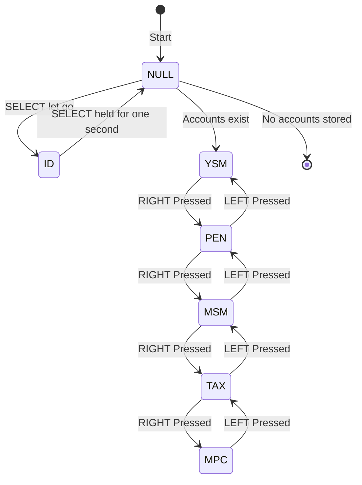

For the Exam on Wednesday, March 5.

[Calculator Website Allowed for the Exam](https://homepage.divms.uiowa.edu/~mbognar/)

---

## **1. Discrete Random Variables (RV), Mass Function, CDF, Expected Value, and Variance**

- **Definition**: A discrete random variable (RV) takes on a countable number of values.
- **Probability Mass Function (PMF)**: P(X=x)P(X = x)
- **Cumulative Distribution Function (CDF)**: F(x)=P(X≤x)F(x) = P(X \leq x)
- **Expected Value**: E[X]=∑xP(X=x)E[X] = \sum x P(X = x)
- **Variance**: Var(X)=E[X2]−(E[X])2Var(X) = E[X^2] - (E[X])^2
- **Properties**: Linearity of expectation, rules for variance calculation

## **2. Discrete RV’s Joint and Conditional Distributions**

- **Joint PMF**: P(X=x,Y=y)P(X = x, Y = y)
- **Marginal PMF**: P(X=x)=∑yP(X=x,Y=y)P(X = x) = \sum_y P(X = x, Y = y)
- **Conditional PMF**: P(X=x∣Y=y)=P(X=x,Y=y)P(Y=y)P(X = x | Y = y) = \frac{P(X = x, Y = y)}{P(Y = y)}
- **Independence**: P(X=x,Y=y)=P(X=x)P(Y=y)P(X = x, Y = y) = P(X = x) P(Y = y)
- **Expectation and Covariance**: Cov(X,Y)=E[XY]−E[X]E[Y]Cov(X, Y) = E[XY] - E[X]E[Y]

## **3. Bernoulli Distribution**

- **Definition**: A discrete RV that takes values 1 (success) with probability pp and 0 (failure) with probability 1−p1 - p.
- **PMF**: P(X=x)=px(1−p)1−x,x∈{0,1}P(X = x) = p^x (1-p)^{1-x}, x \in \{0,1\}
- **Expectation**: E[X]=pE[X] = p
- **Variance**: Var(X)=p(1−p)Var(X) = p(1 - p)

## **4. Binomial Distribution**

- **Definition**: The sum of nn independent Bernoulli trials, each with success probability pp.
- **PMF**: P(X=k)=(nk)pk(1−p)n−kP(X = k) = \binom{n}{k} p^k (1-p)^{n-k}, for k=0,1,...,nk = 0,1,...,n
- **Expectation**: E[X]=npE[X] = np
- **Variance**: Var(X)=np(1−p)Var(X) = np(1 - p)

## **5. Geometric Distribution**

- **Definition**: The number of trials until the first success in a sequence of independent Bernoulli trials.
- **PMF**: P(X=k)=(1−p)k−1pP(X = k) = (1-p)^{k-1} p, for k=1,2,...k = 1,2,...
- **Expectation**: E[X]=1pE[X] = \frac{1}{p}
- **Variance**: Var(X)=1−pp2Var(X) = \frac{1 - p}{p^2}

## **6. Negative Binomial Distribution**

- **Definition**: The number of trials until the rrth success in a sequence of independent Bernoulli trials.
- **PMF**: P(X=k)=(k−1r−1)pr(1−p)k−rP(X = k) = \binom{k-1}{r-1} p^r (1-p)^{k-r}, for k=r,r+1,...k = r, r+1,...
- **Expectation**: E[X]=rpE[X] = \frac{r}{p}
- **Variance**: Var(X)=r(1−p)p2Var(X) = \frac{r(1 - p)}{p^2}

## **7. Poisson Distribution**

- **Definition**: Models the number of events occurring in a fixed interval, given the rate λ\lambda.
- **PMF**: P(X=k)=e−λλkk!P(X = k) = \frac{e^{-\lambda} \lambda^k}{k!}, for k=0,1,2,...k = 0,1,2,...
- **Expectation**: E[X]=λE[X] = \lambda
- **Variance**: Var(X)=λVar(X) = \lambda
- **Poisson Approximation**: Approximates Binomial when nn is large and pp is small with λ=np\lambda = np.

## **Study Tips**

- Understand definitions and derive key formulas.
- Solve practice problems for each distribution.
- Work with joint and conditional probabilities.
- Familiarize yourself with expectation and variance calculations.
- Use properties of independence and covariance to simplify problems.

