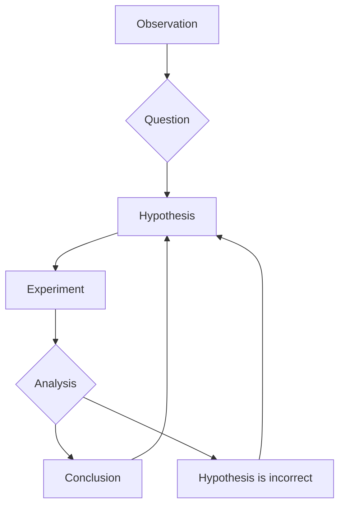

_underlying the scientific standard across most fields_

---

> [!Question]
> What is the goal of science?

In laymanns terms, the goal of science is to explain and describe the natural world through meaningful abstractions.

The fundamental "theorem" of science is that it is purposefully imperfect - we are constantly updating our world model through new theories and experiments. Scientists **want** to have their ideas proven incorrect, as this symbolizes progress in the field.

There are things that out outside the space science can explore. This includes the ideas of morality and personal beliefs, and other concepts like the idea of the **supernatural**.

---

## Process of Science

Namely, there is a **set of core components** common to all scientific analyses methods, although there is **no pre-determined path or formula**.

**Some of these include:**

- Peer Review
- Questions
- Observations
- Data Collection and Analysis
- Observations
- Developing Hypotheses and Predictions

Most, if not all scientists, are inherently **curious**:

- Why does...? How does...?
- How can I Solve this problem?
- What more can I learn about...?

---

## Gluten

[[Gluten]] has some notable properties that make it a useful material in cooking and baking. The process by which we find out these properties is a good example of the scientific method in action.

### Question: How Can the Properties of Gluten-free Products Be Improved?

![[GlutenFreeDietGraph.png]]

This is where another step in the [[Process of Science in Biology|scientific process]] comes in: **Hypotheses** and **Hypotheses testing**

> [!Abstract] Definition
> **Hypothese**: an educated guess or proposed explanation for a phenomenon, based on existing knowledge and observations. It is a testable statement that can be supported or refuted through experimentation and data collection.

> [!Abstract] Definition
> **Prediction**: a specific, testable statement that outlines what will happen in an experiment if the hypothesis is correct. It is a logical consequence of the hypothesis and provides a basis for designing experiments to test the hypothesis.

## Scientists' Hypothesis

Some scientists came up with a new hypotheses:

> Flour used to make gluten-free breads lack molecules that can form structures similar to gluten proteins

And a new prediction:

> Addition of molecules that can form structures similar too gluten will improve the quality of gluten-free breads

^e60f0e

There is actually an example that fits this bottleneck quite well:

> [!Example]
> **Carbohydrates** that form long, coiled structures (e.g. xanthan gum, guar gum) are often added to gluten-free breads to improve their texture and elasticity.

---

## How Scientists Can Test This

Adding more to our scientific process, we can now design an experiment to test this hypothesis and prediction.

- measurable
  - things we can quantify
- test one thing
  - change one variable at a time and keep everything else constant, seeing what happens
- control group/condition
  - compare to a group that does not receive the experimental treatment
- **repeated**
  - repeat the experiment multiple times to ensure results are consistent
- tested in **multiple ways**
  - observe the same phenomenon using different methods or approaches to ensure the results are robust and not dependent on a specific technique

Returning to the [[Process of Science in Biology#^e60f0e|prediction]] formed earlier, what else can we add?

**Have four groups:**

1. Rice flour and tapioca flour (common gluten-free flours)
2. Rice flour, tapioca flour, and xanthan gum
3. Rice flour, tapioca flour, and guar gum
4. Wheat flour (control group)

> [!Warning] Key Point: **Sample size** matters
> results obtained from a larger number of sample are more _likely to reflect the actual effects_ of the variable you are testing
>
> ![[Pasted image 20250827135545.png]]

If you had a $sample \ size = 2$, you might see that $100\%$ prefer having more chips on chocalate chips.

But if you had a $sample \ size = 1000$, you might see that only $52\%$ prefer having more chips on chocalate chips.

This is like a [[Markov Chains Explained - 1|Markhov Chain]] - where the more you traverse the state tree, the closer the probabilities get to the ones you observe

