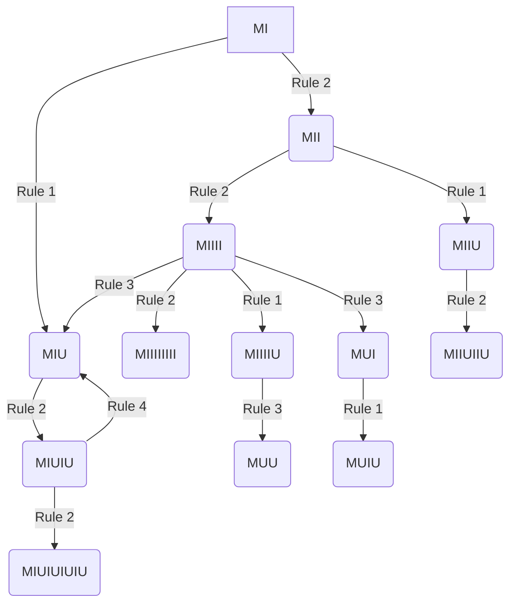

The MU puzzle is a formal system created by Douglas Hofstadter in [[Gödel, Escher, Bach]]. It is a simple set of rules that can be used to manipulate strings of characters. The goal is to determine whether the string `MI` can be transformed into the string `MU` using the rules of the system.

| #   | Formal rule    | Informal explanation                             | Example          |
| --- | -------------- | ------------------------------------------------ | ---------------- |
| 1   | $xI\to xIU$    | Add a `U` to the end of any string ending in `I` | $MI\to MIU$      |
| 2   | $Mx\to Mx x$   | Double the string after the `M`                  | $MIU\to MIUIU$   |
| 3   | $xIIIy\to xUy$ | Replace any `III` with a `U`                     | $MUIIIU\to MUUU$ |
| 4   | $xUUy\to xy$   | Remove any `UU`                                  | $MUUU\to MU$     |

---

There are a lot of interesting properties of the MIU system, but the most important one is that it is impossible to derive the string `MU` from `MI`. This is because the system is designed in such a way that it cannot produce the string `MU` from any starting point.

However, this is not exactly the true goal of the puzzle. While it may be impossible to derive `MU` from `MI`, the true goal is to understand the nature of the rules and how they interact with each other. One will even realize that the rules are not just a set of arbitrary transformations, but rather a reflection of the underlying structure of the system itself.

It also highlights an important charecteristic of human thought: the ability to escape from a system without being "programmed" to do so. The MIU puzzle is a great example of how humans can think outside the box and find solutions that are not immediately obvious. A computer, without any prior programming to tell it that this puzzle is impossible, will continue to try to derive `MU` from `MI` indefinitely, while a human can recognize the futility of the task and move on to other pursuits.

---

Some interesting strategies emerge when trying to solve the MIU puzzle, but the "best" one is to construct a tree of all possible strings that can be derived from `MI` using the rules of the system. This tree will eventually show that `MU` is not reachable from `MI`, and it will also provide a visual representation of the structure of the MIU system. This tree can be pruned to remove branches that lead to Strings that we have already seen, which will make the search more efficient.

---

## Proof

### Proof of Impossibility

#### Only If:

No rule moves the `M`, changes the number of `M`, or introduces any character outside of `M`, `I`, `U`. Therefore, every string derived from `MI` respects the inherent properties of the system.

#### If:

If a string respects these properties, let $N_I$ be the number of `I`s and $N_U$ be the number of `U`s in the string, and let $N = N_I + 3N_U$. The number $N_I$ cannot be divisible by 3, hence $N$ cannot be either. That is:

$$
N \equiv 1 \quad or \quad N \equiv 2 \pmod{3}
$$

Let $n$ be a natural number such that $2^n > N$ and $2^n \equiv N \pmod{3}$. Starting from the axiom `MI`, applying the second rule $n$ times produces a string with $2^n$ consecutive `I`s after the `M`. Since $2^n - N$ is divisible by 3, applying the third rule $(2^n - N)/3$ times will produce a string with exactly $N$ `I`s, followed by some `U`s. The `U` count can be made even by applying the first rule once if necessary. 

Applying the fourth rule repeatedly, all `U`s can be removed, resulting in a string with $N_I + 3N_U$ consecutive `I`s. Finally, applying the third rule strategically to reduce triplets of `I` into a `U` will produce the desired string. Therefore, any string conforming to the system's properties can be derived from `MI`.
