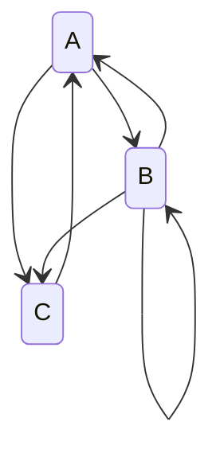

## Problem 1

> [!Question]
> *(6 pts)* For all differentiable maps of the real line having $0$ as a sink, the basin of attraction of $0$ must be a single interval (possibly an unbounded interval).

>[!Failure] False
>  counterexample: $f(x) = -\frac{3}{4}x^3 + \frac{5}{4}x^2 + \frac{1}{2}x$

since $f$ is polynobial and thus differentiable everwhere: $f(0) = 0$, $f'(0) = 1/2$, and thus $0$ is sink.

fixed points: $f(x) = x$ gives $x(3x^2 - 5x + 2) = x(3x-2)(x-1) = 0$, so $x \in \{0,\; 2/3,\; 1\}$.

$$
f'(x) = -\tfrac{9}{4}x^2 + \tfrac{5}{2}x + \tfrac{1}{2}
$$

- $f'(0) = 1/2 < 1$ : sink
- $f'(2/3) = 7/6 > 1$ : repelling (basin boundary)
- $f'(1) = 3/4 < 1$ : sink (second attractor)

now: $f(2) = -6 + 5 + 1 = 0$, so $2 \mapsto 0 \mapsto 0 \mapsto \cdots$. thus $2$ is in the basin of $0$.

but $f(1) = 1$, so $f^n(1) = 1$ for all $n$. $1$ is a fixed point of a different attractor, not in the basin of $0$.

since $0 < 1 < 2$, any interval containing both $0$ and $2$ must contain $1$. the basin of $0$ contains $0$ and $2$ but not $1$, so it is not an interval.

---

## Problem 2

> [!Question]
> *(3 pts)* Every continuous map $f$ from $[0,1]$ into $[0,1]$ has a fixed point. (Hint: *Into* means that $f([0,1]) \subseteq [0,1]$; *onto* means that $[0,1] \subseteq f([0,1])$ and was demonstrated by Theorem 3.17. Draw a picture.)

**True.** Theorem 3.17 covers the onto case ($f(I) \supseteq I$). here we prove the into case ($f([0,1]) \subseteq [0,1]$).

define $g(x) = f(x) - x$, continuous on $[0,1]$. since $f([0,1]) \subseteq [0,1]$:

$$
g(0) = f(0) \geq 0, \qquad g(1) = f(1) - 1 \leq 0
$$

if $g(0) = 0$ or $g(1) = 0$, an endpoint is fixed and we're done. otherwise $g(0) > 0 > g(1)$, so by IVT there exists $c \in (0,1)$ with $g(c) = 0$, i.e. $f(c) = c$.

---

## Problem 3

> [!Question]
> *(6 pts)* If $\tilde{f} : \mathbb{R}^2 \to \mathbb{R}^2$ is a two-dimensional linear map with an attracting fixed point $\tilde{p}$, then the basin of $\tilde{p}$ is all of $\mathbb{R}^2$.

**True.** WLOG translate coordinates so $\tilde{p} = \mathbf{0}$. then $\tilde{f}(\mathbf{x}) = A\mathbf{x}$ for some $2 \times 2$ matrix $A$ with eigenvalues $|\lambda_1|, |\lambda_2| < 1$ (attracting).

$A^n \to 0$: if $A$ is diagonalizable, $A^n = PD^nP^{-1}$ and $D^n = \operatorname{diag}(\lambda_1^n, \lambda_2^n) \to 0$. if $A$ has a Jordan block, entries of $A^n$ are of the form $p(n)\lambda^n$ where $p$ is polynomial, which still vanish for $|\lambda| < 1$.

so for any $\mathbf{x}_0 \in \mathbb{R}^2$:

$$
\tilde{f}^n(\mathbf{x}_0) = A^n \mathbf{x}_0 \to \mathbf{0} = \tilde{p}
$$

every orbit converges to $\tilde{p}$ regardless of initial condition. basin is all of $\mathbb{R}^2$.

---

## Problem 4

> [!Question]
> *(9 pts)* For a differentiable map on $\mathbb{R}$ depending on a parameter $a$, if there is a bifurcation as the parameter is varied continuously, then the Lyapunov number of the orbit at the bifurcation is $1$. Consider both period-doubling and saddle-node bifurcations, as well as higher periods.

**True.** a period-$k$ orbit $\{x_0, \ldots, x_{k-1}\}$ of $f_a$ is a fixed point of $f_a^k$. its eigenvalue is

$$
(f_a^k)'(x_0) = \prod_{i=0}^{k-1} f_a'(x_i)
$$

bifurcation occurs when this eigenvalue crosses the unit circle as $a$ varies. for a real 1D map, the eigenvalue is real, so it can only cross through $+1$ or $-1$:

- **saddle-node**: $(f_a^k)' = +1$ (orbit created/destroyed)
- **period-doubling**: $(f_a^k)' = -1$ (orbit loses stability, spawns double-period orbit)

in both cases, at the bifurcation value $|(f_a^k)'(x_0)| = 1$. the Lyapunov number is

$$
L = \left|(f_a^k)'(x_0)\right|^{1/k} = 1^{1/k} = 1
$$

this holds for fixed points ($k = 1$) and for higher-period orbits undergoing either type of bifurcation.

---

## Problem 5

> [!Question]
> *(6 pts)* For the Logistic Map $G(x) = 4x(1-x)$, every asymptotically periodic orbit is eventually periodic.

**True.** two steps: show all periodic orbits of $G$ are repelling, then show asymptotically periodic implies eventually periodic when the target orbit repels.

**step 1: all periodic orbits of $G$ are repelling.**

substitution $x = \sin^2(\pi\theta)$ conjugates $G$ to the doubling map $\theta \mapsto 2\theta \pmod{1}$, since $G(\sin^2(\pi\theta)) = 4\sin^2(\pi\theta)\cos^2(\pi\theta) = \sin^2(2\pi\theta)$. for a period-$k$ orbit (away from the conjugacy singularity at $x = 0$), the conjugacy gives $|(G^k)'| = 2^k > 1$. at $x = 0$: $|G'(0)| = 4 > 1$ directly.

so every periodic orbit of $G$ is repelling.

**step 2: asymptotically periodic $\implies$ eventually periodic.**

suppose orbit of $x_0$ is asymptotically periodic to $\gamma = \{p_0, \ldots, p_{k-1}\}$, so $x_{nk} \to p_0$ under $G^k$. since $p_0$ is a repelling fixed point of $G^k$ ($|(G^k)'(p_0)| > 1$), there exists $\epsilon > 0$ such that

$$
|G^k(y) - p_0| > |y - p_0| \quad \text{for } 0 < |y - p_0| < \epsilon
$$

if $x_{nk} \neq p_0$ for all large $n$, then eventually $|x_{(n+1)k} - p_0| > |x_{nk} - p_0|$, so distances grow, contradicting $x_{nk} \to p_0$. therefore $x_{nk} = p_0$ for some $n$, making the orbit eventually periodic.

---

## Problem 6

> [!Question]
> *(15 pts, 3 for each part)* Let
>
> $$
> A = \left[0, \tfrac{1}{3}\right], \quad B = \left[\tfrac{1}{3}, \tfrac{2}{3}\right], \quad C = \left[\tfrac{2}{3}, 1\right]
> $$
>
> Let
>
> $$
> f(x) = \begin{cases} \tfrac{1}{3} + 2x & x \in A \\ 2 - 3x & x \in B \\ x - \tfrac{2}{3} & x \in C \end{cases}
> $$
>
> (a) Describe the orbits which begin at the endpoints of $A$, $B$, and $C$, and show the transition graph of $A$, $B$, and $C$.
>
> (b) List all the distinct itineraries of periodic orbits for periods up to and including 5. Be careful not to list different itineraries corresponding to the same orbit (e.g. $AB$ and $ABAB$). List the itineraries in alphabetical order for each period. When there is more than one representation of the same orbit, list only the one that comes first alphabetically. Hint: there are more than 10 and less than 20 total. All itineraries with period greater than 1 begin with $A$. I recommend combining answers 6(b,c,d) into a table.
>
> (c) Create a periodic table for the map up to period 5 (as in Table 1.3).
>
> (d) Give the Lyapunov number of the orbit for each itinerary; if the orbit does not have a Lyapunov number explain why.
>
> (e) Among the orbits up to period 5, what is the orbit of the point having the smallest Lyapunov number? Hint: I'm looking for actual numerical or fractional values, not simply the itinerary. Remember that the Lyapunov number is undefined for orbits containing a kink.

### A

endpoints of $A, B, C$: $\{0, 1/3, 2/3, 1\}$.

$f(0) = 1/3$, $f(1/3) = 1$ (both formulas agree), $f(2/3) = 0$ (both formulas agree), $f(1) = 1/3$.

orbits: $0 \to 1/3 \to 1 \to 1/3 \to \cdots$ and $2/3 \to 0 \to 1/3 \to 1 \to \cdots$. all endpoints are eventually periodic, reaching the 2-cycle $\{1/3, 1\}$. (note $1/3$ is a kink: $f_A'(1/3) = 2 \neq -3 = f_B'(1/3)$.)

images: $f(A) = [1/3, 1] = B \cup C$, $f(B) = [0, 1] = A \cup B \cup C$, $f(C) = [0, 1/3] = A$.



```tikz
\usepackage{tikz}
\usetikzlibrary{positioning, arrows.meta}
\begin{document}
\begin{tikzpicture}[
  box/.style={draw, circle, minimum size=1.2cm, font=\large, thick},
  ->, >=Stealth, semithick, bend angle=20
]
  \node[box] (A) {$A$};
  \node[box, right=2.5cm of A] (B) {$B$};
  \node[box, right=2.5cm of B] (C) {$C$};
  \draw (A) edge[bend left] (B);
  \draw (A) edge[bend left=30] (C);
  \draw (B) edge[bend left] (A);
  \draw (B) edge[loop above, looseness=6] (B);
  \draw (B) edge[bend left] (C);
  \draw (C) edge[bend left=30] (A);
\end{tikzpicture}
\end{document}
```

### B/C/D

slopes: $f_A' = 2$, $f_B' = -3$, $f_C' = 1$. kinks at $x = 1/3$ and $x = 2/3$ (derivative discontinuous). Lyapunov number $L = (2^{n_A} \cdot 3^{n_B})^{1/k}$ where $n_A, n_B$ count $A$'s and $B$'s in the itinerary ($C$ contributes slope 1). undefined if orbit hits a kink.

all pieces are affine, so each periodic system has a unique solution. enumeration uses the transition graph: from $A$, go to $B$ or $C$; from $B$, go to $A$, $B$, or $C$; from $C$, forced to $A$. cyclic itineraries listed as alphabetically first rotation, excluding repetitions of shorter periods.

| $k$ | Itinerary | Orbit (sorted) | $L$ |
|:---:|:----------|:---------------|:----|
| 1 | $B$ | $\{1/2\}$ | $3$ |
| 2 | $AB$ | $\{1/7,\; 13/21\}$ | $\sqrt{6}$ |
| 2 | $AC$ | $\{1/3,\; 1\}$ | undef (kink at $1/3$) |
| 3 | $ABB$ | $\{1/17,\; 23/51,\; 11/17\}$ | $18^{1/3}$ |
| 3 | $ABC$ | $\{1/21,\; 3/7,\; 5/7\}$ | $6^{1/3}$ |
| 4 | $ABAC$ | $\{5/39,\; 3/13,\; 23/39,\; 31/39\}$ | $12^{1/4}$ |
| 4 | $ABBB$ | $\{1/11,\; 5/11,\; 17/33,\; 7/11\}$ | $54^{1/4}$ |
| 4 | $ABBC$ | $\{5/51,\; 7/17,\; 9/17,\; 13/17\}$ | $18^{1/4}$ |
| 5 | $ABABB$ | $\{7/109,\; 17/109,\; 151/327,\; 67/109,\; 211/327\}$ | $108^{1/5}$ |
| 5 | $ABABC$ | $\{1/35,\; 17/105,\; 41/105,\; 23/35,\; 29/35\}$ | $36^{1/5}$ |
| 5 | $ABBAC$ | $\{1/15,\; 1/5,\; 7/15,\; 3/5,\; 11/15\}$ | $36^{1/5}$ |
| 5 | $ABBBB$ | $\{13/161,\; 73/161,\; 239/483,\; 83/161,\; 103/161\}$ | $162^{1/5}$ |
| 5 | $ABBBC$ | $\{13/165,\; 23/55,\; 27/55,\; 29/55,\; 41/55\}$ | $54^{1/5}$ |
| 5 | $ABCAC$ | $\{1/39,\; 7/39,\; 5/13,\; 9/13,\; 11/13\}$ | $12^{1/5}$ |

14 orbits total. only $AC$ has undefined Lyapunov number (orbit passes through the kink at $x = 1/3$).

### E

smallest defined $L$ is $12^{1/5} \approx 1.644$ for itinerary $ABCAC$. the orbit is

$$
\left\{\frac{1}{39},\; \frac{7}{39},\; \frac{5}{13},\; \frac{9}{13},\; \frac{11}{13}\right\}
$$

verification: $1/39 \xrightarrow{f_A} 1/3 + 2/39 = 5/13 \xrightarrow{f_B} 2 - 15/13 = 11/13 \xrightarrow{f_C} 11/13 - 2/3 = 7/39 \xrightarrow{f_A} 1/3 + 14/39 = 9/13 \xrightarrow{f_C} 9/13 - 2/3 = 1/39$ ✓

$L = (2 \cdot 3 \cdot 1 \cdot 2 \cdot 1)^{1/5} = 12^{1/5}$. this orbit has the most $C$'s (slope 1) relative to its length, diluting the expanding effect of $A$ and $B$.

---

## Problem 7

> [!Question]
> *(6 pts)* Let $f$ on $[0,1]$ be defined as
>
> $$
> f(x) = \begin{cases} 3x & x \in \left[0, \tfrac{1}{3}\right] \\ 1.5(1 - x) & x \in \left[\tfrac{1}{3}, 1\right] \end{cases}
> $$
>
> Find the period-2 orbit and compute its Lyapunov number (ignore the fact that $f'$ is not continuous).

$f_1' = 3$, $f_2' = -3/2$. let $L = [0, 1/3]$, $R = [1/3, 1]$.

$LL$: $3 \cdot 3x = x \implies x = 0$ (fixed point). $RR$: $\frac{3}{2}(1 - \frac{3}{2}(1-x)) = x \implies x = 3/5$ (fixed point). neither gives period 2.

$LR$: $x_1 \in L$, $x_2 = 3x_1 \in R$, $x_1 = \frac{3}{2}(1 - x_2) = \frac{3}{2} - \frac{9x_1}{2}$.

$$
\frac{11}{2}x_1 = \frac{3}{2} \implies x_1 = \frac{3}{11}, \quad x_2 = \frac{9}{11}
$$

check: $3/11 \approx 0.273 \in L$ ✓, $9/11 \approx 0.818 \in R$ ✓, $f(3/11) = 9/11$ ✓, $f(9/11) = 3(2/11)/2 = 3/11$ ✓.

$$
L = |f'(x_1) \cdot f'(x_2)|^{1/2} = \left|3 \cdot \left(-\tfrac{3}{2}\right)\right|^{1/2} = \sqrt{\frac{9}{2}} = \frac{3}{\sqrt{2}} = \frac{3\sqrt{2}}{2}
$$

---

## Problem 8

> [!Question]
> *(9 pts, 3 for each part)* This problem concerns the Henon map $f(x, y) = (a - x^2 + by,\; x)$. For certain choices of parameters $a$ and $b$ there is a period doubling bifurcation of the fixed point.
>
> (a) What is the relationship between $a$ and $b$ at such a point?
>
> (b) What are the fixed points in terms of $b$?
>
> (c) What are the eigenvalues of the Jacobian of the map at these points (in terms of $b$)?
>
> Hint: See textbook page 72 and HW3 Q1.

### A

fixed points satisfy $f(x,y) = (x,y)$: from the second component, $y = x$. substituting into the first: $a - x^2 + bx = x$, so

$$
x^2 + (1-b)x - a = 0
$$

Jacobian: $Df = \begin{pmatrix} -2x & b \\ 1 & 0 \end{pmatrix}$. characteristic polynomial: $\lambda^2 + 2x\lambda - b = 0$.

period-doubling requires an eigenvalue $\lambda = -1$. substituting:

$$
1 - 2x - b = 0 \implies x^* = \frac{1-b}{2}
$$

this $x^*$ must be a fixed point, so plug into the fixed point equation:

$$
\left(\frac{1-b}{2}\right)^2 + (1-b)\frac{1-b}{2} = a \implies \frac{(1-b)^2}{4} + \frac{(1-b)^2}{2} = a
$$

$$
\boxed{a = \frac{3(1-b)^2}{4}}
$$

### B

at the bifurcation, $a = 3(1-b)^2/4$. the fixed point equation becomes $x^2 + (1-b)x - 3(1-b)^2/4 = 0$. discriminant: $(1-b)^2 + 3(1-b)^2 = 4(1-b)^2$.

$$
x = \frac{-(1-b) \pm 2(1-b)}{2}
$$

(assuming $b < 1$). two fixed points $(x, y) = (x, x)$:

$$
\tilde{p}_1 = \left(\frac{1-b}{2},\; \frac{1-b}{2}\right), \qquad \tilde{p}_2 = \left(\frac{-3(1-b)}{2},\; \frac{-3(1-b)}{2}\right)
$$

### C

eigenvalues from $\lambda^2 + 2x^*\lambda - b = 0$.

at $\tilde{p}_1$ ($x^* = (1-b)/2$):

$$
\lambda^2 + (1-b)\lambda - b = (\lambda + 1)(\lambda - b) = 0
$$

$$
\lambda_1 = -1, \quad \lambda_2 = b
$$

(confirms the period-doubling: one eigenvalue is exactly $-1$, the other is $b$.)

at $\tilde{p}_2$ ($x^* = -3(1-b)/2$):

$$
\lambda^2 - 3(1-b)\lambda - b = 0
$$

$$
\lambda = \frac{3(1-b) \pm \sqrt{9(1-b)^2 + 4b}}{2} = \frac{3(1-b) \pm \sqrt{9b^2 - 14b + 9}}{2}
$$
