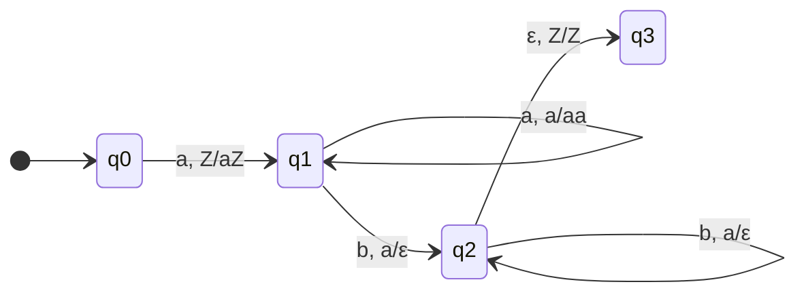

This class will be a quick review of pushdown automata, and a lab + plans for exam review next class.

---

## Pushdown Automata

Pushdown automata are a type of automaton that can use a stack to store information. They are more powerful than finite automata, but less powerful than Turing machines.

They are a variation of a non-deterministic finite automaton (NFA) with an additional stack. The stack allows the PDA to store information about the input string, and use that information to make decisions.

They follow the form of a 7-tuple:

$$(Q, \Sigma, \Gamma, \delta, q_0, Z_0, F)$$

**where:**

- $Q$ is a finite set of states
- $\Sigma$ is a finite input alphabet
- $\Gamma$ is a finite stack alphabet
- $\delta: Q \times (\Sigma \cup \{\epsilon\}) \times \Gamma \rightarrow \mathcal{P}(Q \times \Gamma^*)$ is the transition function
- $q_0 \in Q$ is the start state
- $Z_0 \in \Gamma$ is the initial stack symbol
- $F \subseteq Q$ is the set of accepting states

### Mermaid Example of a PDA

An example of a PDA that accepts the language $a^nb^n$ is shown below:

Where the PDA serves as follows:

- $Q = \{q_0, q_1, q_2, q_3\}$
- $\Sigma = \{a, b\}$
- $\Gamma = \{a, Z\}$
- $q_0$ is the start state
- $Z_0 = Z$ is the initial stack symbol
- $F = \{q_3\}$
- $\delta$ is defined as follows:
  - $\delta(q_0, a, Z) = \{(q_1, aZ)\}$
  - $\delta(q_1, a, a) = \{(q_1, aa)\}$
  - $\delta(q_1, b, a) = \{(q_2, \epsilon)\}$
  - $\delta(q_2, b, a) = \{(q_2, \epsilon)\}$
  - $\delta(q_2, \epsilon, Z) = \{(q_3, Z)\}$

The PDA works by:

1. Pushing an 'a' onto the stack for each 'a' read in state $q_1$
2. Popping an 'a' from the stack for each 'b' read in state $q_2$
3. Accepting when all 'a's are matched with 'b's and the bottom marker 'Z' is reached

In summary, a PDA can be thought of as a finite automaton with a stack, which allows it to store information about the input string and make decisions based on that information.

---

## Pumping Lemma For Pushdown Automata