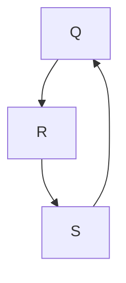
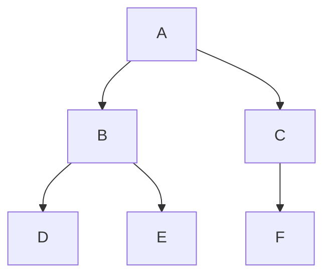
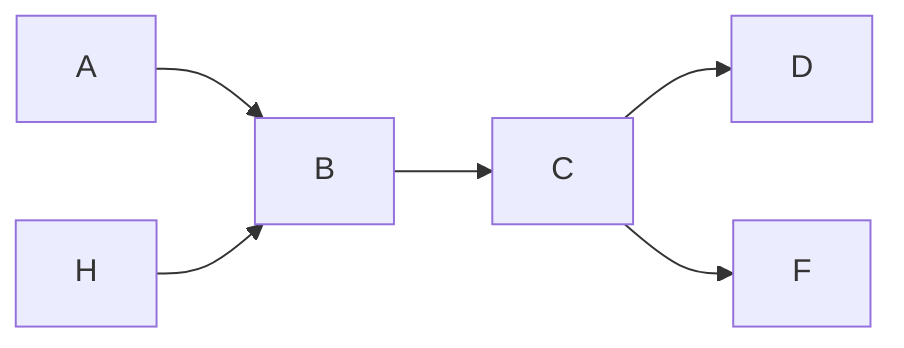
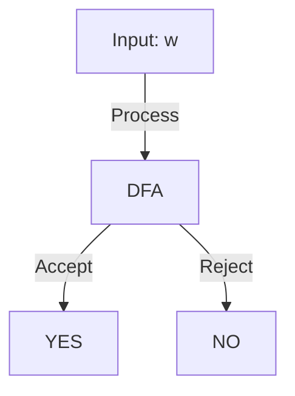
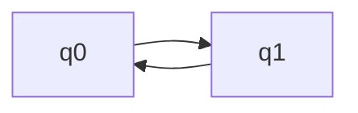

In this class we will continue our work on [[Day 1#Deterministic Finite Automata|Deterministic Finite Automata]], where we will examine tools like Regex to help to understand this agents.

---

## Pigeonhole Principle

The pigeonhole principle is a simple but useful concept in combinatorics. It states that if you have more pigeons than pigeonholes, then at least one pigeonhole must contain more than one pigeon.

![[Pasted image 20250116083819.png]]

---

## Graphs

In this class we will consider a graph to be a **two tuple** - based data structure.

We use the following to describe this relation:

$$
G = (V,E)
$$

Where:

- **V** is the vertex set "nodes"
- **E** is the edge set

We can represent $V$ as a list of nodes:

$$
V = \{ A,B,C,D \}
$$

and $E$ as a list of double-value tuples:

$$
E = \{ \{ A,B \}, \{ A,C \}, \{ B,D \}, \{ D,C \}, \{ B,C \} \}
$$

This yields a graph that we can consider to look like this:

![[Pasted image 20250116084351.png]]

### Directed and Undirected Graphs

The graph above doesn't cover the full picture, as the edges of graphs can also have "directions". This makes sense because in the world of computer science, we often work with **Pointers**, which can only be traversed in one direction.

The corresponding equations for this graph would look something like the following:

$$
Y = \{ Q,R,S \}
$$

$$
E = \{\{ R,Q \}, \{ Q,S \}, \{ S,R \} \}
$$

### Terminology for Connections

If an edge connects vertices A and B:

_A is adjacent to B_ means they **share an edge**

### How We Define how Many Edges a Node Has

**Degree** means the number of incident edges

- **In-Degree** is number of incoming edges
- **Out-Degree** is number of outgoing edges

---

## Trees

All **Trees** are considered **Graphs**, but not all graphs are trees.

A tree is a structured form of a graph, defined as being an _undirected acyclic graph_

Sometimes we have a **rooted tree**, and sometimes we don't. We are more used to rooted trees coming from Computer Science, but they can present themselves as otherwise

`rooted tree`

`non rooted tree`

---

## Strings

A **String** is considered _an ordered collection of symbols and/or characters_

Strings can be **indexed**, meaning we can get a certain character at a specified position in the string.

In Computing and Complexity, we will mostly be working with **bit strings**, which is just a string of `0`'s and `1`'s.

### Binary Alphabet

We will be dealing with things called **Binary Alphabets**, which are defined using what we know from Mathematics as **Sigma**($\sum$)

$$
\begin{align*}
\sum &= \{ 0,1 \} \\
\sum &= \{ a,b,c \} \\
\end{align*}
$$

For this course please know that Sigma wont be used for sums, and will always be talking about creating one of these Binary Alphabets.

### String Terminology

We define strings like so:

$$
\begin{align*}
w_{1} &= cat \\
w_{2} &= food
\end{align*}
$$

We can concatenate strings like the following:

$$
w_{1} \circ w_{2} = catfood
$$

We define an **empty string** as:

$$
\epsilon = empty \ string
$$

---

## Lexicographic order "Shortlex"

The Shortlex order is a way to order strings in a way that is similar to how we order numbers.

$$
\sum = \{ 0,1 \}
$$

$$
{\sum} ^* = strings \ of \ zero\ or\ more\ symbols\ from\ \sum
$$

Kleene Star is a way to represent the set of all strings that can be made from a given alphabet.

$$
{Kleene}^* \ \ \ \ \ * zero \ or \ more
$$

Empty strings come into this Shortlex orden and represent the first in this new order of ours:

$$
0 \circ \epsilon = 0
$$

$$
1 \circ \epsilon = 1
$$

### The Shortlex Order

This isnt the full thing, but conveys the general idea of the order we mean to follow when we describe this.

$A = {\sum}^*$

| 1   | $\epsilon$ |
| --- | ---------- |
| 2   | 0          |
| 3   | 1          |
| 4   | 00         |
| 5   | 01         |
| 6   | 10         |
| 7   | 11         |
| 8   | 000        |

---

## Deterministic Finite Automata Continued

What even is a **DFA**?

- Where we defined a **Graph** as a `2-tuple`, we define a **DFA** as a `5-tuple`:

$$
M =\left( Q,\sum, \delta, q_{0}, F \right)
$$

Where:

- $Q$ is a finite set of states
  - Think of these as vertices/nodes
- $\sum$ is a finite set of symbols
  - The "Alphabet" we discussed
- $\delta$ is the **transition function**
- $q_{0}$ is the start state
  - $q_{0} \in Q$
- $F \subseteq Q$ is the Set of **accepting states**

DFA is a **pattern matching machine** given a certain task

Here is what a DFA could look like under the hood:

$$
A = \left\{  w | w \in {\sum}^* \ and \ |w| \ is \ even \right\}
$$

This example DFA would recognize a string like `0001` is in the "language" or not

Let's try and make this machine, given that we can only construct it out of the variables and states that we defined just now.

We have no ram, no stack, no nothing we know? How do we do this?

Let's define $q_{0}$ as the start state, and $F$ as the set of accepting states.

Traversing 

