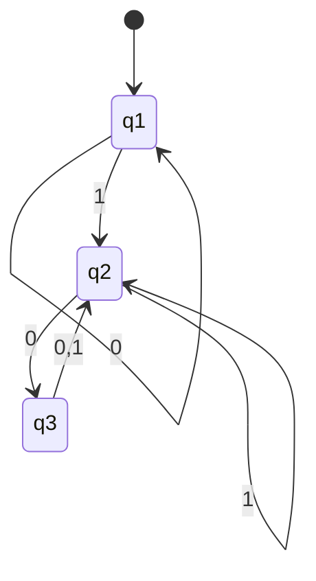

This class will continue on the subject of DFA's and the Chomsky hierarchy.

---

## Formal Definition of a DFA

Refresher on the formulaic definition of a DFA.

$$
M_{DFA} = \left( Q, \sum, \delta, q_{0}, F\right)
$$

We define each of the variables in the [[Day 2 - Deterministic Finite Automata#Deterministic Finite Automata Continued|DFA Definition]].

Today we will re-examine equivalent representations:

- state diagrams
- mathematical notation

For our DFA's:o

- a DFA must have. **exactly** one out arrow for every symbol in $\sum$
- a DFA must have **exactly** one out arrow for every state in $Q$

Let's navigate this DFA:

$$
Q = \{ q_{1},q_{2},q_{3} \}
$$

$$
\sum = \{ 0,1 \}
$$

| $\delta$ | $0,1$         |
| -------- | ------------- |
| $q_{1}$  | $q_{1},q_{2}$ |
| $q_{2}$  | $q_{3},q_{2}$ |
| $q_{3}$  | $q_{2},q_{2}$ |

---

## Where Does the Memory come From?

The memory in a DFA comes from the states. The states are the memory of the DFA.

This machine only needs to remember where it is in the state diagram. Everything else is determined by the current state.

### Memory Implications

1. **Finite Memory**

   - A DFA has a fixed number of states
   - Cannot count beyond its number of states
   - Cannot remember arbitrary amounts of history

2. **State as Memory**
   - Each state represents a distinct "memory configuration"
   - The current state encodes all relevant historical information
   - No additional storage or variables needed

### Limitations of DFA Memory

1. **Cannot Count Indefinitely**

   - Example: Cannot verify if number of 0's equals number of 1's
   - Would require infinite states to track all possibilities

2. **No Push-down Storage**

   - Cannot maintain a stack or queue
   - Cannot check for nested patterns (like matching parentheses)

3. **Pattern Recognition Limits**
   - Can only recognize patterns within its state capacity
   - Cannot recognize patterns requiring unbounded memory

### Examples of What DFAs Can/Cannot Do

**Can Do:**

- Check if string ends in specific pattern
- Verify if number is even/odd
- Check if string contains specific substring
- Ensure alternating patterns

**Cannot Do:**

- Check if string is a palindrome of arbitrary length
- Verify balanced parentheses
- Compare counts of different symbols
- Remember arbitrary historical information

### Practical Applications

1. **Lexical Analysis**

   - Token recognition in programming languages
   - Pattern matching in text processing

2. **Protocol Verification**

   - Checking message sequences
   - State-based protocol validation

3. **Hardware Design**
   - Circuit state machines
   - Control logic implementation

### Memory Efficiency

1. **State Minimization**

   - Equivalent states can be combined
   - Reduces memory requirements
   - Maintains same functionality

2. **Optimal Design**
   - Use minimum states needed
   - Careful state transition planning
   - Consider trade-offs between states and complexity

---

Remember: The power of a DFA lies in its simplicity - it only needs to track its current state. This limitation is also its strength, making DFAs efficient and predictable for many practical applications.
