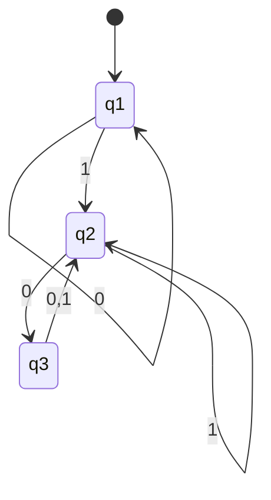

This class will continue on the subject of DFA's and the Chomsky hierarchy.

---

## Formal Definition of a DFA

Refresher on the formulaic definition of a DFA.

$$
M_{DFA} = \left( Q, \sum, \delta, q_{0}, F\right)
$$

We define each of the variables in the [[Day 2#Deterministic Finite Automata Continued|DFA Definition]].

Today we will re-examine equivalent representations:

- state diagrams
- mathematical notation

For our DFA's:o

- a DFA must have. **exactly** one out arrow for every symbol in $\sum$
- a DFA must have **exactly** one out arrow for every state in $Q$

Let's navigate this DFA:

$$
Q = \{ q_{1},q_{2},q_{3} \}
$$

$$
\sum = \{ 0,1 \}
$$

| $\delta$ | $0,1$         |
| -------- | ------------- |
| $q_{1}$  | $q_{1},q_{2}$ |
| $q_{2}$  | $q_{3},q_{2}$ |
| $q_{3}$  | $q_{2},q_{2}$ |

---

## Where Does the Memory come From?

The memory in a DFA comes from the states. The states are the memory of the DFA.

This machine only needs to remember where it is in the state diagram. Everything else is determined by the current state.
