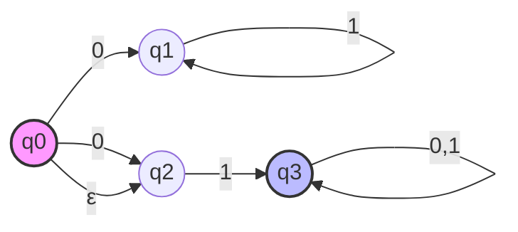

This class will discuss RL's and their closure properties, proof of closure under union, and non-determinism.

---

## Randomized Logarithmic-space

As a refresher, Randomized Logarithmic-Space (RL) is a complexity class that represents decision problems solvable by a Turing machine using logarithmic space and a source of randomness.

The machine must provide a correct "yes" answer with high probability (at least 2/3) and can err on "no" answers, or vice versa. RL is significant because it explores the efficiency of algorithms in extremely constrained memory environments while leveraging randomness to achieve solutions that may not be possible deterministically in the same space bounds.

### Closure Properties of Randomized Logarithmic-space

Closure properties are important in complexity theory because they help us understand how complexity classes relate to each other and how they can be combined to solve more complex problems.

> [!Warning] Claim
> RLs are closed under union.

If we have two RLs A and B, we can construct a new RL that is the union of A and B. This means that the new RL can solve problems that are in A or B, which is a powerful property for combining different algorithms and solutions.

### Proof of Closure Under Union

We will now prove the closure of RLs under union by constructing a new RL that can solve problems in A or B.

Simulate machines $M_{A}$ and $M_{B}$ on the input x. If either machine accepts, accept. If both machines reject, reject. If both machines accept, flip a coin and accept with probability 2/3.

Let $M_{A}$ recognize language "$M_{B}$ recognize".

Construct $M$ to recognize $A \cup B$

$$
Q = \{ (r_{1},r_{2})|r_{1}\in Q_{A}, r_{2} \in Q_{B} \}
$$

This set is cross product $Q_{A} \times Q_{B}$.

For each $(r_{1},r_{2}) \in Q$ for each symbol in $\sum$

$$
\delta ((r_{1},r_{2}), a) = ( \delta_{A} (r_{1},a), \delta_{B}(r_{2}, a) )
$$

---

## Non-Determinism

An NFA is a non-deterministic finite automaton. It is a theoretical model of computation that can be used to solve decision problems. An NFA is similar to a DFA but has some key differences that make it more powerful and flexible.

Let's Distinguish between a **DFA** and an **NFA**

### DFA

- every state has exactly one out arrow on each symbol in $\sum$
- Deterministic

### NFA

- a state may have $0, 1,$ or more out arrows on each symbol in $\sum$
- non-deterministic

Let's consider the following example:

This diagram shows an NFA (not a DFA) with the following properties:

- Initial state q0 (pink filled)
- Accepting state q3 (blue filled with double border)
- From q0, it can transition to q1 or q2 on input 0, or to q2 on ε (empty string)
- State q1 loops back to itself on input 1
- From q2, it transitions to q3 on input 1
- q3 loops back to itself on both inputs 0 and 1

**Once an NFA reaches the end of its input string, if ANY of the output arrows are in an accepting state, it accepts.**

NFAs are more powerful than DFAs because they can represent more complex patterns and behaviors. However, they are also harder to analyze and simulate because of their non-deterministic nature.
