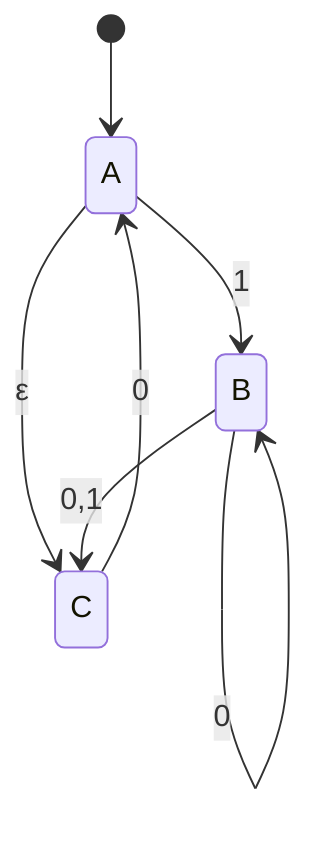
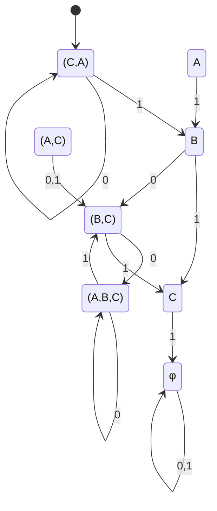
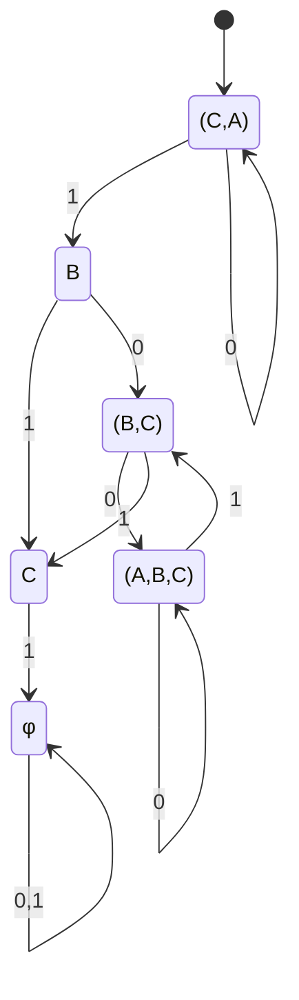

 

This class will discuss the conversion of an NFA to equivelant DFA by subset construction algorithm.

---

## Subset Construction

Subset construction is a method to convert a non-deterministic finite automaton (NFA) to an equivalent deterministic finite automaton (DFA). The algorithm works by simulating the NFA's behavior using sets of states in the DFA.

$$
\begin{aligned}
\text{Input: } & \text{NFA } M = (Q, \Sigma, \delta, q_0, F) \\
\text{Output: } & \text{DFA } M' = (Q', \Sigma, \delta', q_0', F') \\
\\
\text{Method:} & \\
1.\ & Q' = \text{Power set of Q} \\
2.\ & q_0' = \epsilon\text{-closure}(q_0) \\
3.\ & F' = \{R \in Q' | R \cap F \neq \emptyset\} \\
4.\ & \text{For each set } R \in Q' \text{ and each input symbol } a \in \Sigma: \\
& \delta'(R,a) = \epsilon\text{-closure}(\bigcup_{p \in R} \delta(p,a))
\end{aligned}
$$

Let's apply this to a NFA Example:

- white dot is entry point
- Highlighted node is accepting state

Describing this NFA logically:

$$
Q = \{ A,B,C \} \ \ \ |Q| = 3
$$

$$
P(Q) = \{ \phi, \{ A \}, \{ B \}, \{ C \}, \dots
$$

_$\dots$ are continued below:_

$$
|P(Q)|_{=2^3 = 8 values} \to \{ A,B \}, \{ B,C \}, \{ C,A \}, \{ A,B,C \} \}
$$

### Turning This into a DFA

Because the NFA has logic in which multiple states can exist at once, we need to do some reworking.

We should, at the bare minimum, get something like the following:

To turn this into a DFA, we need to consider the following steps:

1. **Initial State Determination**:

   - Start with q0' = ε-closure(A)
   - Since A has an ε-transition to C, q0' = {A,C}

2. **State Transitions**:

   - For state {A,C}:

     - On input 0: A->∅, C->A = {A}
     - On input 1: A->B, C->∅ = {B}

   - For state {A}:
     - On input 0: A->∅ = {∅}
     - On input 1: A->B = {B}
   - For state {B}:

     - On input 0: B->B,C = {B,C}
     - On input 1: B->C = {C}

   - For state {C}:
     - On input 0: C->A = {A}
     - On input 1: C->∅ = {∅}

3. **DFA Representation**:

This DFA now recognizes exactly the same language as the original NFA but in a deterministic manner.

We also then prune the values that have no "In" arrows, those being A, and (A,C).

*it doesnt say so in the diagram, but any state that CONTAINS A is considered an accepting state.*

### The Process We Follow

1. create states in DFA for each element of $P(Q)$ where $Q$ is set of states in NFA
2. for each transition consider all possible destinations and draw transitions to states with corresponding label
3. recursively prune states that have no incoming transitions

Please note that these conversions get exponentially complex as the number of states in the NFA increases.
