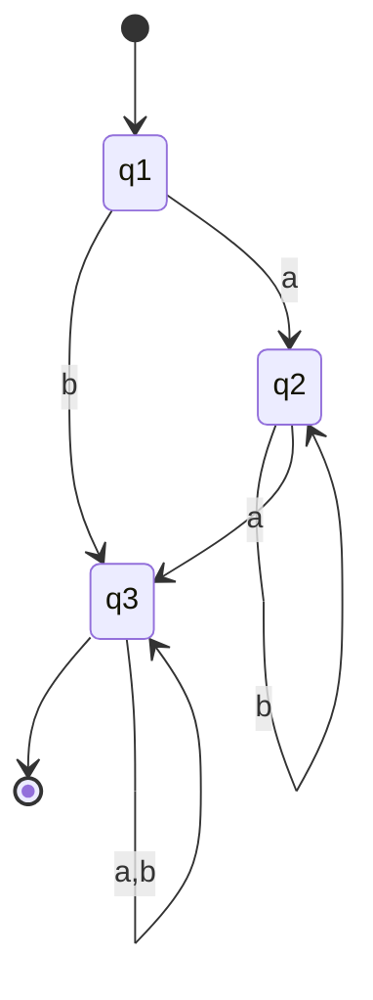

This class will discuss state elimination, more on REGEX, and how they relate to DFAs and NFAs.

---

## REGEX Continued

For your information:

$$
Regex \leftarrow\rightarrow Finite \ Automota
$$

Regex machines are equivalent to finite automata, in that they can recognize the same languages.

But also keep in mind that:

$$
Regular \ Expression \to NFA \to DFA
$$

This is the process of converting a regular expression to a DFA.

And:

$$
Finite \ Automota \to Regular \ Expression
$$

