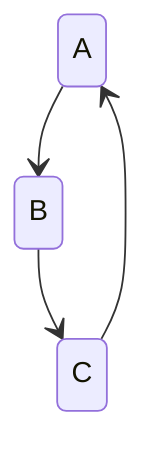

It is an unfortunate fact that there are some problems that cannot be solved by any algorithm. These problems are undecidable. The most famous example of an undecidable problem is the Halting Problem, which states that there is no algorithm that can determine whether a given program will halt or run forever.

---

## Undecidable Languages

Turing machines are the most powerful computational model we have, and they can recognize a wide variety of languages. However, there are some languages that Turing machines cannot recognize. These languages are called undecidable languages.

We will look at:

- Countability & Uncountability
- Cantors diagonalization
- proofs that undecidable languages must exist
- example of undecidable languages

And remember:

> [!Warning] Important
> **A language is a set of strings**

and that Descriptions of machines are strings

### Notation

$\langle x \rangle$ or $\langle \ \rangle$  is a string representation of some object

And for a tree:

Wet a string of the sort:

$$
(\{ A,B,C \}, \{ \{ A,B \}, \{ B,C \}, \{ C,A \} \})
$$

And also remember:

$$
M = \text{ "On Input} \langle a \rangle
$$

- where $a$ is an undirected

---

## Building Inventory of Decidable Languages

$A$ is decidable when we know some machine $M_{A}$ exists that decides $A$:

$$
A_{DFA} = \{  \langle B, \omega \rangle \mid \text{B is a DFA that accepts string } \omega \}
$$

Our theorem right now is that $A_{DFA}$ is decidable
