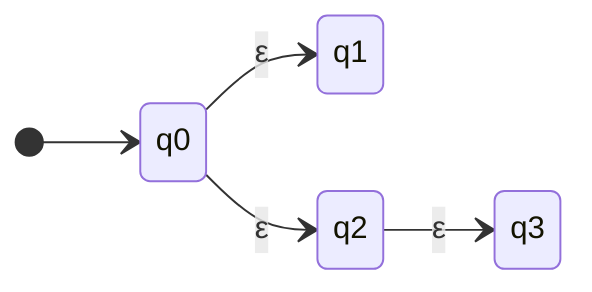
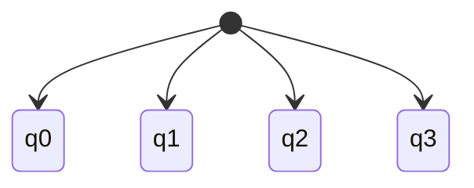
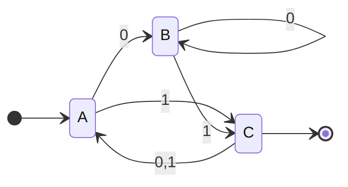
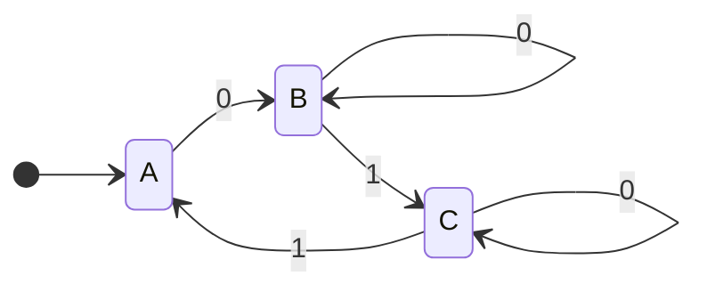
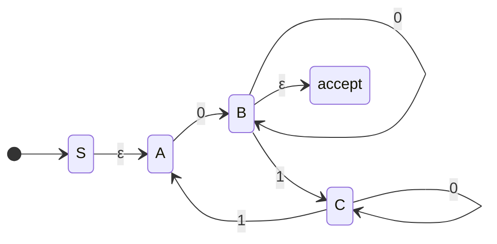

For the first exam, you should be prepared to

- answer questions about definitions, properties, and behaviors of DFAs, NFAs, and GNFAs,
- determine whether a string is in the language of some finite automaton,
- design a DFA or NFA given some language (which may or may not involve closure properties),
- determine the language of a given DFA or NFA,
- determine if a string matches a given regular expression,
- convert a given NFA to an equivalent DFA using subset construction algorithm, and
- recover a regular expression from a finite automaton using state elimination.

---

## Proofs

We will get proofs, oftentimes by oconstruction:

Let $L = \{ w \mid w \ is \ of \ odd \ length \ and \ contains \ 000 \ as \ substring \}$

We would be asked to **prove that L is regular**

- this would be proof by construction of a finite automaton

---

## NFAs/DFAs $\epsilon$ Transition

*An **epsilon transition** (ε-transition) in a finite automaton is a transition between states that occurs **without consuming any input symbol**. This means the automaton can move from one state to another "for free," without reading a character from the input string.*

Given a NFA:

Looks like the following DFA:

---

## Formal Definition

Given a state diagram machine $M$:

We have a 5 tuple:

$$
M = \left( Q, \sum, \delta, q_{0}, F \right)
$$

**Q:**

$$
Q = \{ B,C, A \}
$$

$\sum$:

$$
\sum = \{ 0,1 \}
$$

$\delta$:

For this we can make a table

| $\delta$ | 0   | 1   |
| -------- | --- | --- |
| A        | B   | C   |
| B        | B   | C   |
| C        | A   | A   |

or with equations:

$$
\begin{align*}
\delta(A, 0) = B \\
\delta(A, 1) = C \\
etc\dots
\end{align*}
$$

$q_{0}$:

just the start state

$$
q_{0} = A
$$

$F$(always a set, accepting states):

$$
F = \{ C \}
$$

---

## State Elimination

Say we have the following unpruned DFA:

We want to recover an equivalent regex using state elimination

RIP  states in the order $C,B,A$

1. Construct GNFA

Let's start RIPPING:

**RIP C:**

$$
B \to C \to A: \ \ 11, 1 \Sigma^* 1
$$

**RIP B:**

$$
\begin{align*}
&A \to B \to X: 0 0^* \epsilon = 00^* = 0^+ \\
&A \to B \to A: 0 0^* \left( 1 \Sigma ^* 1 \right)
\end{align*}
$$

**RIP A:**

$$
S \to A \to X: \epsilon 0^+ = \left( \frac{00^*}{0^+}(1 \Sigma^* 1) \right)^* 0^+
$$

---

## Closure Properties of Regular Languages

**Theorem**: The class of regular languages is closed under the union operation. That is, if languages $A$ and $B$ are regular, then $A \cup B$ is regular.

**Theorem**: The class of regular languages is closed under the concatenation operation. That is, if languages $A$ and $B$ are regular, then $A \circ B$ is regular.

**Theorem**: The class of regular languages is closed under the Kleene star operation. That is, if language $A$ is regular, then $A^{*}$ is regular.

**Theorem**: the class of regular languages is closed under the reversal operation. That is, if language $A$ is regular, then $A^{\mathcal{R}}$ is regular.

**Theorem**: The class of regular languages is closed under complementation. That is, if language $A$ is regular, then $\bar{A}$ is regular.

---

## NFAs and DFAs Equivalent

**Theorem**: Every nondeterministic finite automaton has an equivalent deterministic finite automaton. (This is proven using subset construction.)  

**Corollary**: A language is regular if and only if some nondeterministic finite automaton recognizes it.

---

## Definition of a Regular Expression

We say that $R$ is a regular expression if $R$ is:

1. $a$ for some $a$ in the alphabet $\Sigma$
2. $\epsilon$, the empty string
3. $\emptyset$, the empty language
4. $(R_{1} \cup R_{2})$, where $R_{1}$ and $R_{2}$ are regular expressions
5. $(R_{1} \circ R_{2})$, where $R_{1}$ and $R_{2}$ are regular expressions, or
6. $(R_{1}^*)$, where $R_{1}$ is a regular expression

