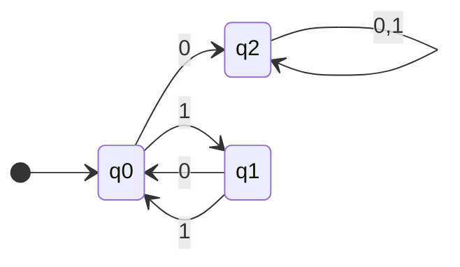
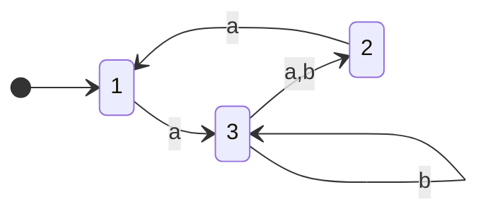
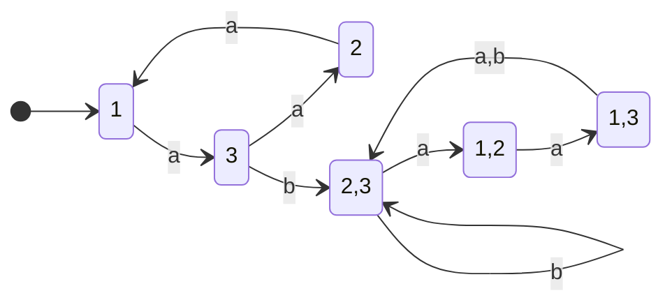

> **Abstract**

> This document the formal definitions and constructs for 3 primary DFAs/NFAs, with two extra considered for extra credit. We seek to prove that a language is regular by providing a DFA that recognizes it.

---

## Definitions

We define a **DFA/NFA** as a 5 tuple:

$$
M =\left( Q,\sum, \delta, q_{0}, F \right)
$$

Where:

- $Q$ is a finite **set of states**
- $\sum$ is a finite **set of symbols**
- $\delta: Q \times \sum \to Q$ is the **transition function**
- $q_{0} \in Q$ is the **start state**
- $F \subseteq Q$ is the Set of **accepting states**

---

## Problem 1

Construct a DFA that recognizes the language:

$$
\{ w \mid w \ every \ odd \ position \ of \ w \ is \ a \ 1\}
$$

Provide a formal definition _and_ a state diagram. $\sum = \{ 0,1 \}$

### Formal Definition

**States**

$$
Q = \{ q_{0},q_{1}, q_{2} \}
$$

- $q_{0}$ is state where next symbol is odd position
- $q_{1}$ is state where next symbol is even position
- $q_{2}$ is the sink state for all error

**Language/Alphabet**

$$
\sum = \{ 0,1 \}
$$

**Transition Function** $\delta$

| $\delta$ | $0$     | $1$     |
| -------- | ------- | ------- |
| $q_{0}$  | $q_{2}$ | $q_{1}$ |
| $q_{1}$  | $q_{0}$ | $q_{0}$ |
| $q_{2}$  | $q_{2}$ | $q_{2}$ |

**Start State**

$$
q_{0}
$$

**Accepting States**

$$
F = \{ q_{0},q_{1} \}
$$

### State Diagram

*provided by mermaid*

- white dot is start state entry point
- highlighted state is accept state

---

## Problem 2

For any string $w = w_{1}w_{2}\dots w_{n}$, the reverse of w, written $w^\mathcal{R}$, is the string $w$ in reverse order, $w_{n}\dots w_{2}w_{1}$. For any language $A$, let $A^\mathcal{R} = \{ w^\mathcal{R} \mid w \in A \}$.

Prove that if $A$ is regular, so is $A^\mathcal{R}$. For this, consider how, starting with any arbitrary NFA to recognize $A$, you'd modify the NFA to recognize $A^\mathcal{R}$. Once you have the idea, write a recipe that would work for any NFA.

### Idea / Goal

We are looking to show that when $A$ is regular, so is $A^\mathcal{R}$. Suppose $A$ is an NFA that:

$$
N = \left\{  Q, \sum, \delta, q_{0}, F \right\}
$$

Where this NFA can be represented as $L(N)=A$. We want to create an NFA that recognizes $A^\mathcal{R}$

### Construction

We define this new NFA as $M'$:

$$
M' = \left( Q', \sum', \delta', q_{0}', F' \right)
$$

It remains *relatively* unchanged compared to the original, except for a few key differences:

- we add a new **state**, $q_{0}'$ to the states set $Q$, where $Q' = Q \cup \{ q_{0}' \}$
- we reverse the transitions in the transition function:
	- if $p$ can transition to $q$ through $a$, then we reverse the transition $q\to^ap$
	- for the accept states

---

## Problem 3

---

## Extra Credit Problem A

Convert the following NFA to an equivalent DFA. For _subset construction_, follow the recipe provided by Sipser Theorem 1.39 and the corresponding proof (as presented in class). Leave your construction unpruned, but be sure to indicate any unnecessary or unreachable states in the DFA thus constructed, if any.

### Listing Transitions

For state **1**:

$$
\delta(1,a) = \{ 3 \}
$$

and has no b transition

For state **2**:

$$
\delta(2,a) = \{ 1 \}
$$

For state **3**:

$$
\delta(3,a) = \{ 2 \}
$$

$$
\delta(3,b) = \{ 3,2 \}
$$

since the b route goes to 2 and 3

### Defining New DFA

1. We define the **start state** as $\{ 1 \}$
2. Going from $\{ 1 \}$ to:
	- $a$: $\delta(1,a) = \{ 3 \}$
	- $b$: $\delta(1,b) = \{ \emptyset  \}$
3. Going from $\{ 3 \}$ to:
	- $a$: $\delta(3,a) = \{ 2 \}$
	- $b$: $\delta(3,b) = \{ 3,2 \}$
4.  Going from $\{ 2 \}$ to: ( note we define this as accept state )
	- $a$: $\delta(2,a) = \{ 1 \}$
	- $b$: $\delta(2,b) = \{ \emptyset \}$
5. Going from $\{ 2,3 \}$ to: ( also contains accept state )
	- $a$: $\delta(2,a) \cup \delta(3,a) = \{ 1,2 \}$
	- $b$: $\delta(2,b) \cup \delta(3,b) = \emptyset \cup \{ 3,2 \} \to \{ 3,2 \}$
6. Going from $\{ 1,2 \}$ to: (also contains accept state )
	- $a$: $\delta(1,a) \cup \delta(2,a) =\{ 1,3 \}$
	- $b$: $\delta(1,b) \cup \delta(2,b) =\emptyset \cup \emptyset \to \emptyset$
7. Going from $1,3$ to:
	- $a$: $\delta(1,a) \cup \delta(3,a) = \{2,3 \}$
	- $b$: $\delta(1,b) \cup \delta(3,b) = \emptyset \cup \{ 2,3 \} \to \{ 2,3 \}$
8. For Dead States $\emptyset$:
	- for $a$ and $b$: $\delta(\emptyset, b) = \{\emptyset\}$

### Constructing Table Of Transitions

| **DFA State** | **On $a$**  | **On $b$**  | **Accepting** |
| ------------- | ----------- | ----------- | ------------- |
| $\{ 1 \}$     | $\{ 3 \}$   | $\emptyset$ | No            |
| $\{ 3 \}$     | $\{ 2 \}$   | $\{ 2,3 \}$ | No            |
| $\{ 2 \}$     | $\{ 1 \}$   | $\emptyset$ | **Yes**       |
| $\{ 2,3 \}$   | $\{ 1,2 \}$ | $\{ 2,3 \}$ | **Yes**       |
| $\{ 1,2 \}$   | $\{ 1,3 \}$ | $\emptyset$ | **Yes**       |
| $\{ 1,3 \}$   | $\{ 2,3 \}$ | $\{ 2,3 \}$ | No            |
| $\emptyset$   | $\emptyset$ | $\emptyset$ | No            |

**Note:**

I could be wrong, but it seems as though all states are reachable here, so no pruning would be needed even if we wanted to.

### Constructing the DFA

Defining a DFA for:

$$
M =\left( Q,\sum, \delta, q_{0}, F \right)
$$

- **States**: $\{ 1 \}, \{ 3 \}, \{ 2 \}, \{ 2,3 \}, \{ 1,2 \}, \{ 1,3 \}, \emptyset$
- **Alphabet**: $\{ a,b \}$
- **Start State**: $1$
- **Accepting States**: $\{ 2 \}, \{ 2,3 \}, \{ 1,2 \}$
- **Transtions**:
	- 1 goes to 3 and $\emptyset$
	- 3 goes to 2 and 2,3
	- 2 goes to 1 and $\emptyset$
	- 2,3 goes to 1,2 and 2,3
	- 1,2 goes to 1,3 and $\emptyset$
	- 1,3 goes to 2,3 and 2,3
	- $\emptyset$ goes to $\emptyset$ and $\emptyset$

### Diagram

*provided by mermaid*

