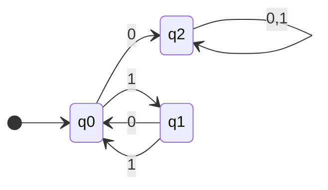

> **Abstract**

> This document the formal definitions and constructs for 3 primary DFAs/NFAs, with two extra considered for extra credit. We seek to prove that a language is regular by providing a DFA that recognizes it.

---

## Definitions

We define a **DFA/NFA** as a 5 tuple:

$$
M =\left( Q,\sum, \delta, q_{0}, F \right)
$$

Where:

- $Q$ is a finite **set of states**
- $\sum$ is a finite **set of symbols**
- $\delta: Q \times \sum \to Q$ is the **transition function**
- $q_{0} \in Q$ is the **start state**
- $F \subseteq Q$ is the Set of **accepting states**

---

## Problem 1

Construct a DFA that recognizes the language:

$$
\{ w \mid w \ every \ odd \ position \ of \ w \ is \ a \ 1\}
$$

Provide a formal definition _and_ a state diagram. $\sum = \{ 0,1 \}$

### Formal Definition

**States**

$$
Q = \{ q_{0},q_{1}, q_{2} \}
$$

- $q_{0}$ is state where next symbol is odd position
- $q_{1}$ is state where next symbol is even position
- $q_{2}$ is the sink state for all error

**Language/Alphabet**

$$
\sum = \{ 0,1 \}
$$

**Transition Function** $\delta$

| $\delta$ | $0$     | $1$     |
| -------- | ------- | ------- |
| $q_{0}$  | $q_{2}$ | $q_{1}$ |
| $q_{1}$  | $q_{0}$ | $q_{0}$ |
| $q_{2}$  | $q_{2}$ | $q_{2}$ |

**Start State**

$$
q_{0}
$$

**Accepting States**

$$
F = \{ q_{0},q_{1} \}
$$

### State Diagram

*provided by mermaid*

- white dot is start state entry point
- highlighted state is accept state

---

## Problem 2

For any string $w = w_{1}w_{2}\dots w_{n}$, the reverse of w, written $w^\mathcal{R}$, is the string $w$ in reverse order, $w_{n}\dots w_{2}w_{1}$. For any language $A$, let $A^\mathcal{R} = \{ w^\mathcal{R} \mid w \in A \}$.

Prove that if $A$ is regular, so is $A^\mathcal{R}$. For this, consider how, starting with any arbitrary NFA to recognize $A$, you'd modify the NFA to recognize $A^\mathcal{R}$. Once you have the idea, write a recipe that would work for any NFA.

### Idea / Goal

We are looking to show that when $A$ is regular, so is $A^\mathcal{R}$. Suppose $A$ is an NFA that:

$$
N = \left\{  Q, \sum, \delta, q_{0}, F \right\}
$$

Where this NFA can be represented as $L(N)=A$. We want to create an NFA that recognizes $A^\mathcal{R}$

	## Construction