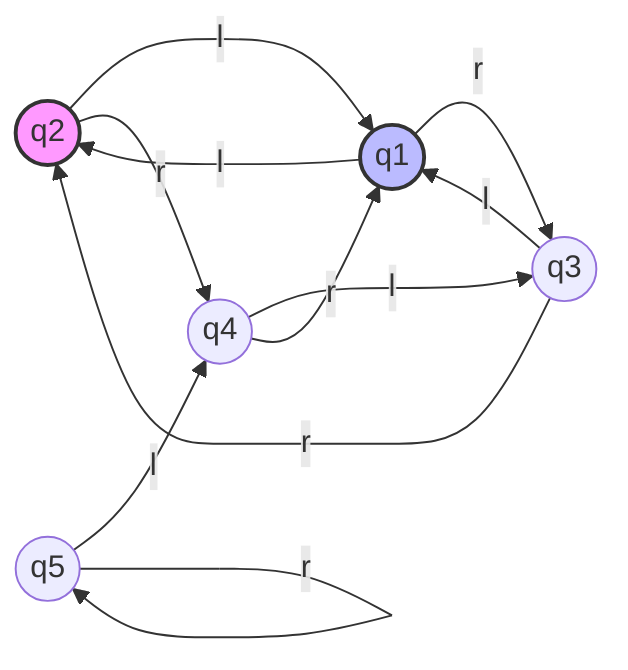
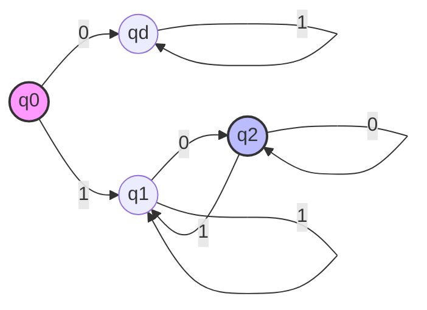
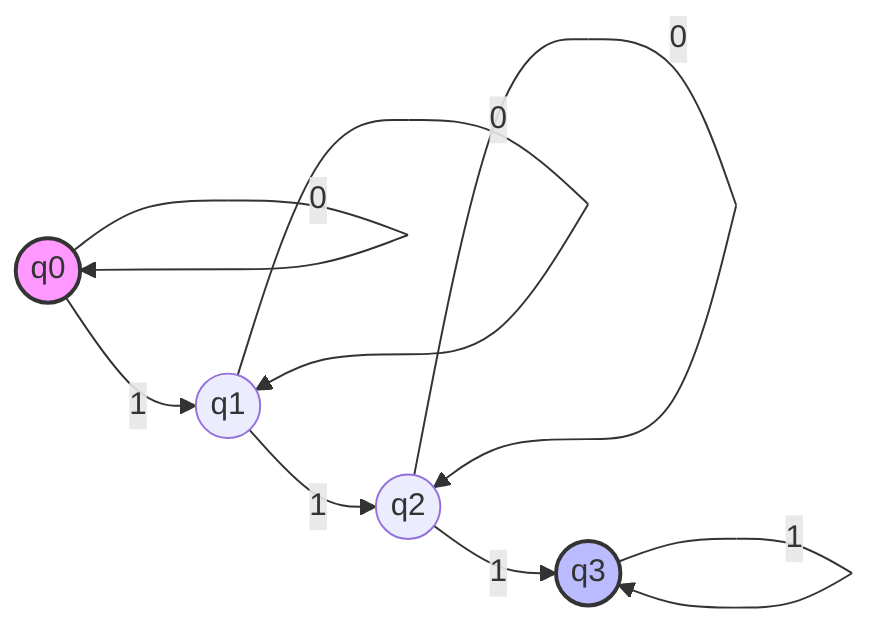
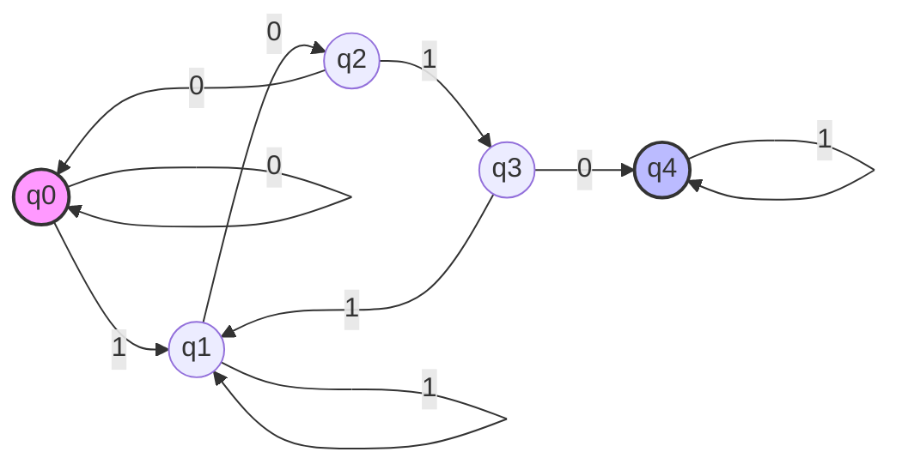
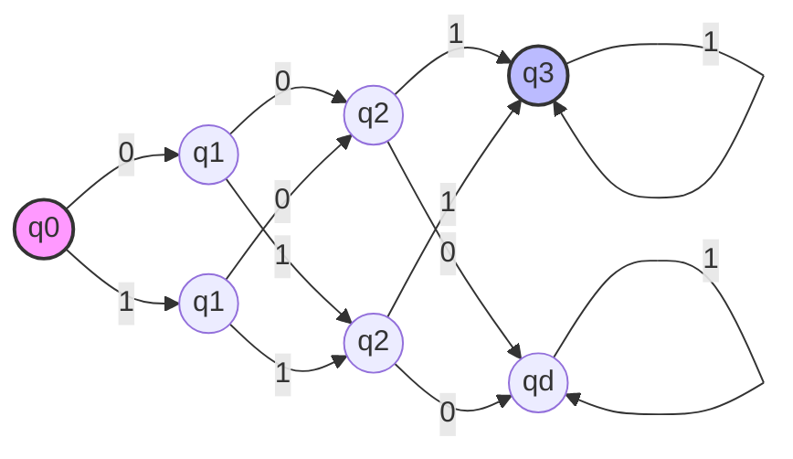

Given the following formal definition of a finite automaton, M2M2​, produce a complete state diagram.

M2= ({q1,q2,q3,q4,q5},{l,r},δ,q2,{q1})M2​=({q1​,q2​,q3​,q4​,q5​},{l,r},δ,q2​,{q1​}) where δδ is given by

|     | l   | r   |     |
| --- | --- | --- | --- |
| q1​ | q2  | q3  |     |
| q2  | q1  | q4  |     |
| q3  | q1  | q2  |     |
| q4  | q3  | q1  |     |
| q5  | q4  | q5  |     |
|     |     |     |     |

---

## Problem 3

Give state diagrams for the following languages. IN all parts, the alphabet is $\{ 0,1 \}$

### A

$$
\{ w|w \ begins \ with \ a \ 1 \ and \ ends \ with \ a \ 0\}
$$

### B

$$
\{ w|w \ contains \ at \ least \ three \ 1s \}
$$

	

### C

$$
\{ w|w \ contains \ the \ substring \ 1010,  \ i.e. w = x1010y \ for \ some \ x \ and \ y .\}
$$

### D

$$
\{ w|w \ is \ of \ length \ at \ least \ three, \ and \ its \ third \ symbol \ is \ 1 \}
$$

