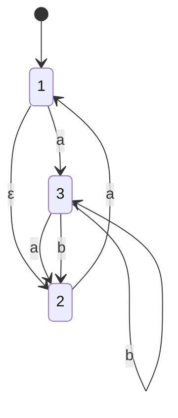
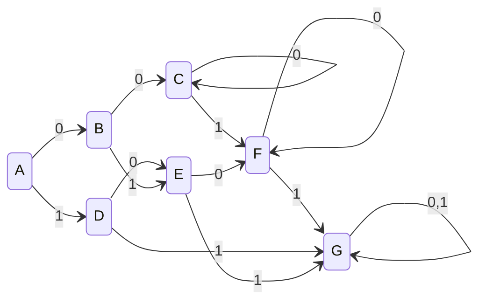
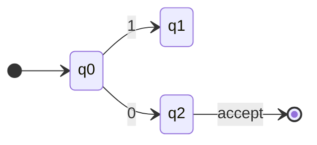

```mermaid
stateDiagram-v2
    [*] --> 1
    1 --> 3 : a
    1 --> 2 : ε
    3 --> 2 : a
    3 --> 2 : b
    3 --> 3 : b
    2 --> 1 : a
    state 2 <<final>>
```

---

## Problem 3

$$
A = \left\{  W|W contains at least 2 0's and at most one 1 \right\}
$$

### Mermaid Diagram

```mermaid
stateDiagram
    direction LR
    A --> B : 0
    B --> C : 0
	C --> C : 0
	C --> F : 1
	F --> F : 0
	F --> G : 1
	G --> G : 0,1
	A --> D : 1
	D --> E : 0
	B --> E : 1
	E --> F : 0
	D --> G : 1
	E --> G : 1
    
    C:::accepting
    F:::accepting
	
    classDef accepting fill:#bbf,stroke:#333,stroke-width:2;
```

```mermaid
stateDiagram-v2
	direction LR
	[*] --> q0
	q0 --> q1:1
	q0 --> q2:0
	q2 --> [*]: accept
```

