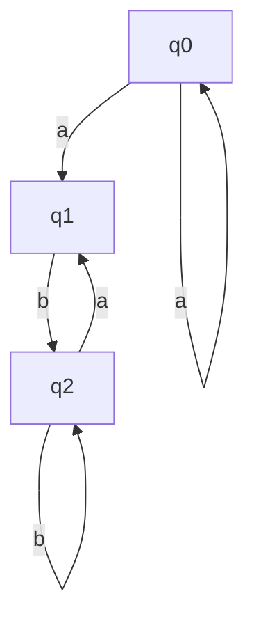
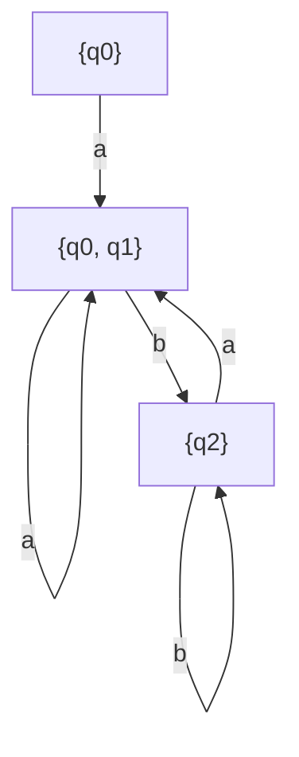
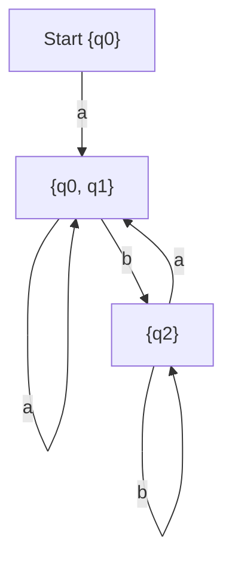

This guide explains how to convert a **Nondeterministic Finite Automaton (NFA)** into a **Deterministic Finite Automaton (DFA)** using the **subset construction method** with emphasis on the **RIP steps (Reachable, Identify, Prune)**.

## **Step 1: Understanding the Given NFA**

An **NFA** allows multiple transitions for the same input, including ε (epsilon) transitions.  
Let's assume we are given the following **NFA**:

Here:

- q0q_0 is the start state.
- q2q_2 is the accepting state.

## **Step 2: Apply the Subset Construction Algorithm**

The **DFA** states will be sets of **NFA** states.

### **R: Reachable**

1. Start from the ε-closure of the initial state `{q0}`.
2. Compute transitions by taking the union of reachable states.

#### **Transition Table for the DFA**

|DFA State|Corresponding NFA States|a Transition|b Transition|
|---|---|---|---|
|`{q0}`|`{q0}`|`{q0, q1}`|Ø|
|`{q0, q1}`|`{q0, q1}`|`{q0, q1}`|`{q2}`|
|`{q2}`|`{q2}`|`{q1}`|`{q2}`|

### **I: Identify**

- Identify equivalent states.
- Here, `{q2}` is an accepting state because it contains `q2`.

### **P: Prune**

- Remove unreachable states (if any).
- All states in this example are reachable.

## **Step 3: Construct the Final DFA**

Now, the DFA is:

### **Final DFA:**

- **Start State:** `{q0}`
- **Accepting States:** `{q2}`

This is the deterministic equivalent of the given NFA.
