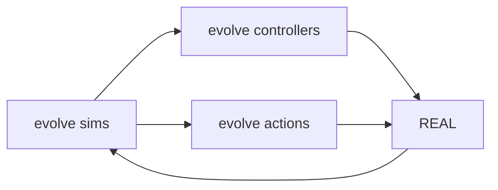

Spearheaded by our very own [[Joshua Bongard]], the Resilient Machines Project is anohter attempt to solve the **reality gap**, instead by attempting to construct robots that understand how their body degrades, and adapts to it.

---

There are **three approaches** to [[Evolutionary Robotics]]:

1. Evolve controllers directly on a physical robot

This requires hundreads if not thousands of [[Physical Simulation]]s, timely and costly

2. Create a simulation of the robot, and perform some or all of controller evolution in simulation before transferal to the physical device.

Downside is a human is needed to hand craft a simulator, back to the **reality gap** problem

3. Adapt controllers on the phsyical robot from an original, hand-created controller

Human is needed to hand craft the original controller.

Always something of the sort:

There is another approach: the **Estimation-Exploration Algorithm (EEA)**, where the robot builds its own self-model through exploratory actions rather than relying on a hand-crafted simulator. 

probes its own body, observes *sensory feedback*, and infers a model of its own morphology; controllers are then evolved inside that self-model. when the body degrades, the loop runs again, adaptation is automatic without human intervention at any stage.

---

## The Experiment

the robot probes its own body with random actions, observes sensory feedback, and uses that to build a self-model. a simulation of its own morphology it constructed itself, no human required.

controllers are then evolved inside that self-model and transferred to the real robot. when the robot's body degrades, predicted vs. actual behavior diverges, and the loop restarts: new probes, updated model, new controllers. adaptation is fully autonomous at every stage.

![[Screenshot 2026-03-19 at 8.57.10 AM.png]]

> I do this a lot, but this is very similar to [[Active Inference]] again. I have drawn connections to the [[Free Energy Principle]], but here this mirrors how active inference seeks to take [[Epistemic Action]]("active sensing"), instead of passively waiting for information, an agent will *probe* the system to resolve uncertainty/maximize information gain.
> 
> agent will probe environment when unsure of the state ( exploration ). drive to reach a goal or state will take over, like for finding food ( exploitation ), all this through the lense of weighing the **expected free energy**, as *resolving uncertainty first makes future goal seeking more efficient*.

> ![[resMachinesContinuousModeling.png]]
>
> *Outline of the algorithm. The robot continuously cycles through action execution. (A and B) Self-model synthesis. The robot physically performs an action (A). Initially, this action is random; later, it is the best action found in (C). The robot then generates several self-models to match sensor data collected while performing previous actions (B). It does not know which model is correct. (C) Exploratory action synthesis. The robot generates several possible actions that disambiguate competing self-models. (D) Target behavior synthesis. After several cycles of (A) to (C), the currently best model is used to generate locomotion sequences through optimization. (E) The best locomotion sequence is executed by the physical device. (F) The cycle continues at step (B) to further refine models or at step (D) to create new behaviors.*

from [@bongardResilientMachinesContinuous2006]

### Result

It is able to locomote! By developing its own world model and simulation.

Eventually, these advancements lead to **world models**, however a bit of a difficult story there!

---

## [[Multi Objective Optimization]]

optimizing for multiple, often conflicting objectives simultaneously, typically producing a [[Pareto Front]] of trade-off solutions rather than a single optimum.
