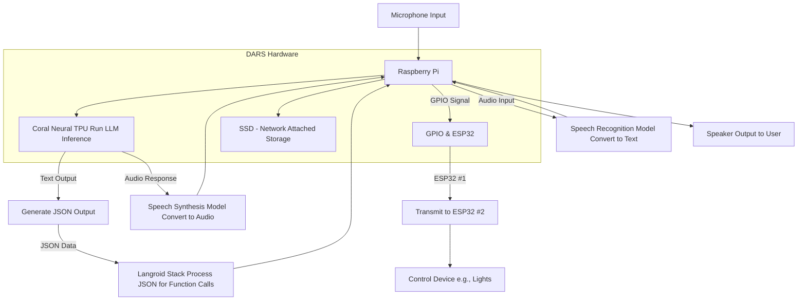

I am sure we are all aware of how language models like GPT have taken off in recent years. They have opened up a world of possibilities through the medium of natural language, with a lot of opportunity to rework/replace a lot of software defined natural language tools.

The idea of voice assistants have always interested me. We have all seen movies like Iron Man where these advanced, human-like voice assistants interact with people very naturally.

## What is DARS?

DARS is a home assistant that combines the natural language interpretation capabilities of Large Language Models with discrete, programmatic output so that it can be used to control/activate functions in a room.

This includes

- Managing home appliances and lights
    
- Interacting with local files for a notetaking/todolist system
    
- Routing your song request to spotify to play it
    
- Managing software, like a web server / site
    

Beyond its functionality, DARS also features:

- Voice synthesis to clone the voice of TARS from Interstellar
    
- Custom, fine tuned personality via local model
    
- Local speech recognition
    
- Humor Setting ( and maybe a discretion one! )
    

## How Does It Work?

- Voice Synthesis, Recognition, and (parts of) local LLM run on Coral TPU Ai Accelerator
	- What can’t be run on device is run via cloud
	

![[Screenshot 2024-12-04 at 1.42.47 PM.png|350]]

- Language Model Generates formatted json to run functions
	- Provides arguments and is pre-prompted on when to call functions

- Function calls are either run on Pi ( note taker, humor setter) or sent to the Master ESP-32
	- Master can connect to several other ESP-32’s to control room device power

![[Screenshot 2024-12-04 at 1.43.16 PM.png|350]]

### Hardware Architecture

---

## Photo And Video Gallery

See [[DARS Media Gallery]] for some photos through the development process!

See [[DARS]] for a video demonstration!
