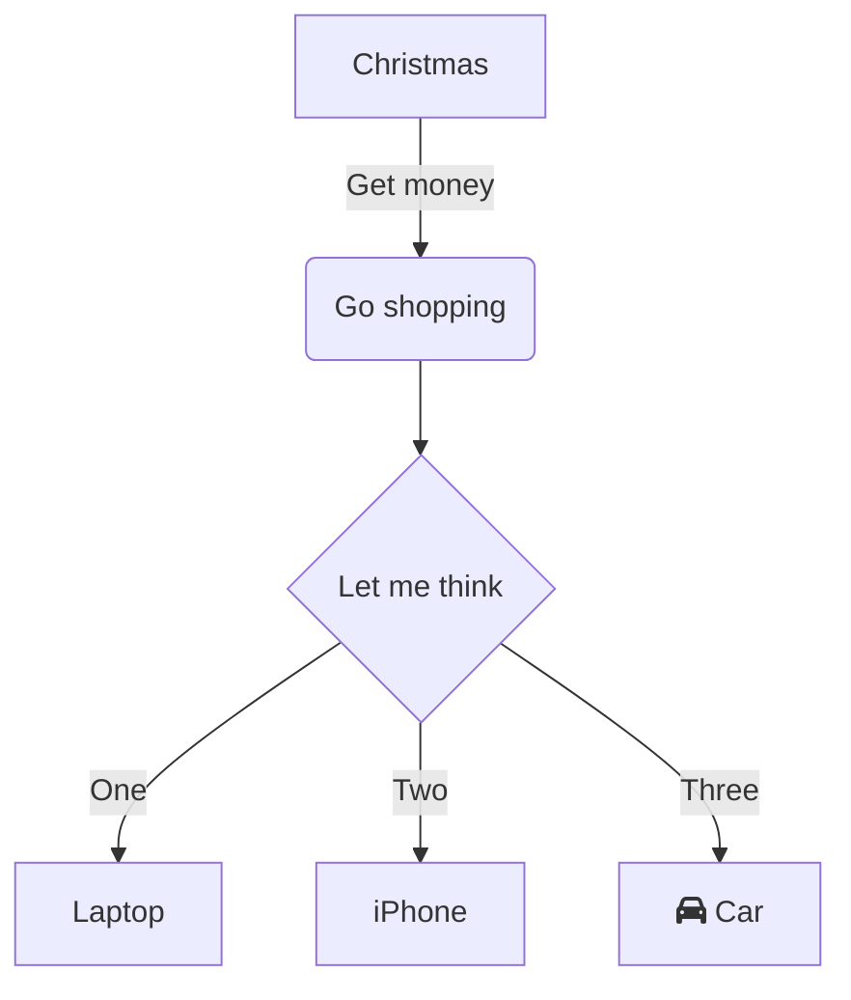
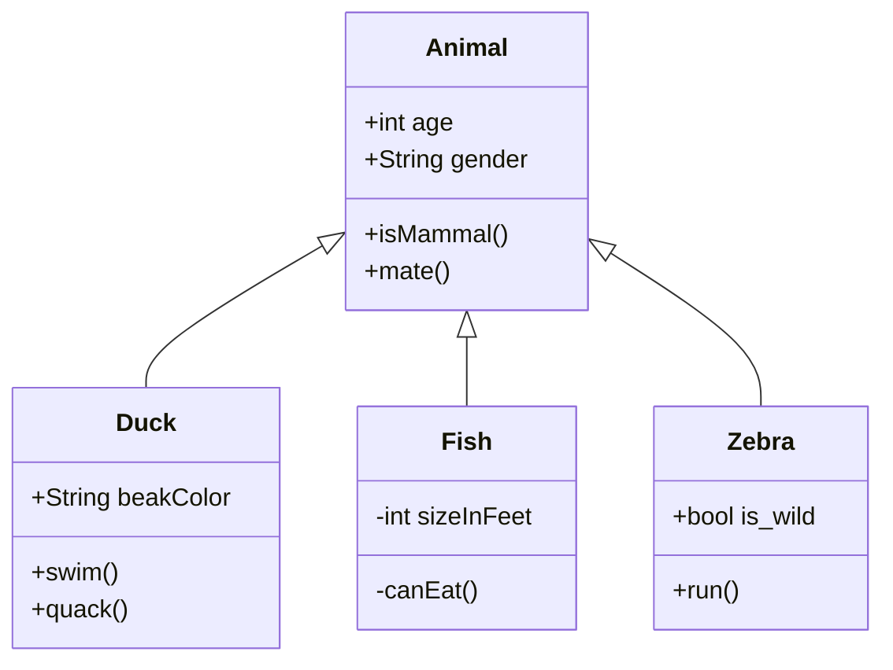
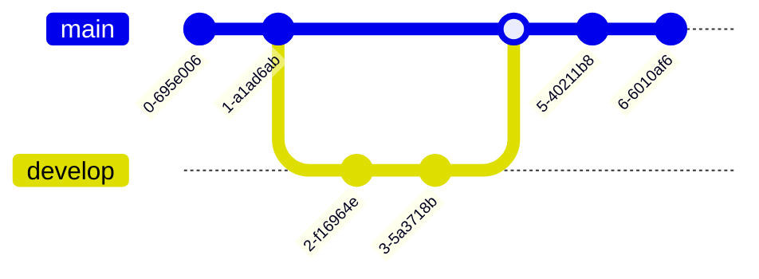

This is just a cheatsheet of cool obsidian formatting and whatnot that I like to write down

For a more comprehensive list just use the [obsidian formatting guide](https://help.obsidian.md/Editing+and+formatting/Basic+formatting+syntax)

> [!Info]
> Author - Ewan Pedersen
> Class - MATH2248
> Date - 09/26/2024

*although i think putting this stuff in the metadata is usually preferred*

Maybe a little foreword on the topic before we dive in.

---

## Lesser Known Obsidian Shorthands

| Syntax          | Description                                                                                                               |
| --------------- | ------------------------------------------------------------------------------------------------------------------------- |
| `[[Link]]`      | [Internal links](https://help.obsidian.md/Linking+notes+and+files/Internal+links)                                         |
| `![[Link]]`     | [Embed files](https://help.obsidian.md/Linking+notes+and+files/Embed+files)                                               |
| `![[Link#^id]]` | [Block references](https://help.obsidian.md/Linking+notes+and+files/Internal+links#Link%20to%20a%20block%20in%20a%20note) |
| `^id`           | [Defining a block](https://help.obsidian.md/Linking+notes+and+files/Internal+links#Link%20to%20a%20block%20in%20a%20note) |
| `%%Text%%`      | [Comments](https://help.obsidian.md/Editing+and+formatting/Basic+formatting+syntax#Comments)                              |
| `~~Text~~`      | [Strikethroughs](https://help.obsidian.md/Editing+and+formatting/Basic+formatting+syntax#Bold,%20italics,%20highlights)   |
| ==Text==`       | [Highlights](https://help.obsidian.md/Editing+and+formatting/Basic+formatting+syntax#Bold,%20italics,%20highlights)       |
| ` ``` `         | [Code blocks](https://help.obsidian.md/Editing+and+formatting/Basic+formatting+syntax#Code%20blocks)                      |
| `- [ ]`         | [Incomplete task](https://help.obsidian.md/Editing+and+formatting/Basic+formatting+syntax#Task%20lists)                   |
| `- [x]`         | [Completed task](https://help.obsidian.md/Editing+and+formatting/Basic+formatting+syntax#Task%20lists)                    |
| `> [!note]`     | [Callouts](https://help.obsidian.md/Editing+and+formatting/Callouts)                                                      |
| (see link)      | [Tables](https://help.obsidian.md/Editing+and+formatting/Advanced+formatting+syntax#Tables)                               |

---

## Desmos Embeds

do something like this

> [!Info] Desmos
> <iframe src="https://www.desmos.com/calculator/aj9wwbqagm" width=600 height="400" ></iframe>

---

## Code Embeddings and Matplotlib Graphing

You can use the obsidian codeblocks to make runnable scripts within your notes. I like to use this with python and matplotlib to make graphs when desmos cannot.

One caveat is that you have to import your libraries with `micropip`. This would look something like the following.

```python
import micropip
await micropip.install("matplotlib")
await micropip.install("numpy")

import numpy as np
import matplotlib.pyplot as plt
from mpl_toolkits.mplot3d import Axes3D
from matplotlib import cm

# Create figure and 3D axis
fig = plt.figure()
ax = fig.add_subplot(111, projection='3d')

# Define the grid for the plane
x = np.linspace(-5, 5, 30)
y = np.linspace(-5, 5, 30)
x, y = np.meshgrid(x, y)
z = 0.5 * x + 0.2 * y  # Equation of a plane: z = 0.5x + 0.2y

# Plot the plane
ax.plot_surface(x, y, z, cmap=cm.viridis, alpha=0.6)

# Define a point on the plane
point = np.array([2, 1, 0.5 * 2 + 0.2 * 1])  # (x, y, z) = (2, 1, 1.2)

# Plot the point
ax.scatter(point[0], point[1], point[2], color='r', s=100)

# Define a direction vector
direction = np.array([1, 1, 0.5 * 1 + 0.2 * 1])  # Vector with slope matching the plane

# Normalize the direction for plotting an arrow
direction_normalized = direction / np.linalg.norm(direction)

# Plot the direction as an arrow from the point
ax.quiver(point[0], point[1], point[2], direction_normalized[0], direction_normalized[1], direction_normalized[2], color='b', length=2, arrow_length_ratio=0.2)

# add a projection at the bottom of the graph of where the direction vector is pointing
ax.plot([point[0], point[0] + direction_normalized[0]], [point[1], point[1] + direction_normalized[1]], [0, 0], color='b', linestyle='--')

# Set labels
ax.set_xlabel('X axis')
ax.set_ylabel('Y axis')
ax.set_zlabel('Z axis')
ax.set_title('3D Plane with Point and Direction')

# Show plot
plt.show()
```

---

## Mermaid Diagrams

Obsidian has some built in diagram tooling with some help from [Mermaid](https://mermaid.live/edit#pako:eNpVkEFrg0AQhf_KMKcG9A94KCTa5pLSQnOqehh0dJdkd5Z1JQT1v3eNLbRzmuF97zG8CRtpGTPsrnJrFPkA56KyEGdf5srrIRgaakjT5_nIAYxYvs9weDoKDEqc07bfbfxhhSCfTivGEJS2l2WT8of_3fIMRXkiF8TVf5XzTWZ4KfWHivH_FeU5ul7LjrKO0oY85ORrTNCwN6Tb-Pq0GioMig1XmMW1JX-psLJL5GgM8nm3DWbBj5ygl7FXGMOuQ7xG11LgQlPvyfwi3Oog_m0r5tFPgo7sl4j5MS7f0pBlZg)

Here are some example diagrams you can make with mermaid.

**Flow Chart**



**UML Class Diagram**



**Git Diagram**



Mermaid also supports charts, but not nearly to the extent that the [[Scientific Note Cheatsheet#Charts Subsection - Charts View Plugin]] supports.

---

## Embedding Math

Obsidian has some builtin math stuff that allow you to embed latex/mathjax within your notes.

There is **inline** math, defined by whatever lates is in between two dollar symbols`$$`

$f(x) = 2x^2 + \frac{2}{4}$ is an example of inline math

There are also **math blocks**, which center themselves on your notebook similar to how latex does it.

$$L = \int_{2}^4 \sin (x)dx$$

Math blocks and inline support all sorts of latex formatting, including color, etc.

---

## Obsidian Links

**Im going to stick to wikilinks unless im reference a url or whatnot**

You can link notes together in obsidian using the `[[Note Title]]` syntax. This will create a link to the note with the title `Note Title`.

You can take this further by defining a certain header to jump to, but also define a label for the link.

`[[Note Title#Header Title|Label]]`

You can embed notes in your own note by putting an exclamation mark in front of the link.

`![[Note Title]]`

This can also be used to embed images and other files.

### Non Wikilinks

you can use the `[]()` syntax to put normal links and such. This works, but has some wierd behavior. Use this for url links, and you can use for [[Scientific Note Cheatsheet#Website Specific Embeds|embedding some websites]]

---

## Website Specific Embeds

Along with using iframes to embed websites, we can also use a "player" for some specific cites:

along the form of

``

where you put the link inside the `()`

it will come out like this:


This works for youtube, but also twitter/x:


---

## Tags

Tags are great in obsidian, not just for what they do in the graph view, but because they themselves also behave like directories.

we can do:

`#notes`

Which works fine, but is very general.

But we can also do:

`#notes/math/calculus`

Which falls under the category of notes, but also is a specific subset of notes and math.

---

## Callouts

A variety of callouts can be used to highlight important information in your notes.

Obsidian defines a callout as a blockquote with a special class. You can use the following classes to define different callouts.

`> [!Callout Name] Title`

`> content`

### Standard Callouts

These callouts have standard use cases and titles, but you can overide the title yourself if you want.

**Info**

> [!Info] Title
> content

**Warning**

> [!Warning] Title
> content

**Tip**

> [!Tip] Title
> content

**Success**

> [!Success] Title
> content

**Question**

> [!Question] Title
> content

**Quote**

> [!Quote] Title
> content

**Example**

> [!Example] Title
> content

**Note**

> [!Note] Title
> content

**Important**

> [!Important] Title
> content

**Abstract**

> [!Abstract] Title
> content

**Failure**

> [!Failure] Title
> content

**Alert**

> [!Alert] Title
> content
